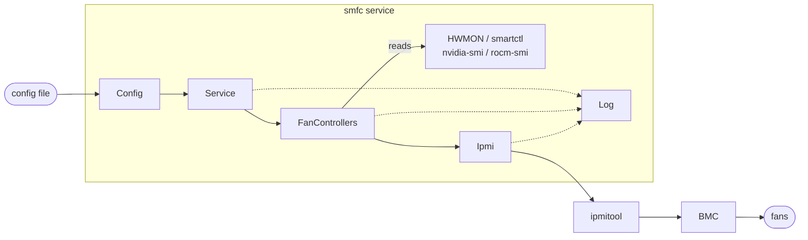
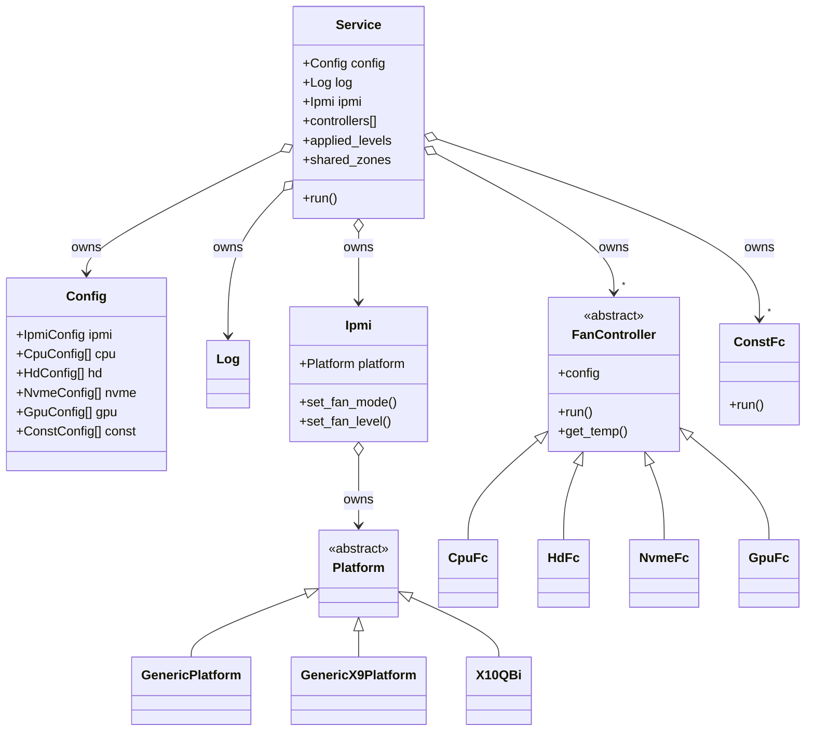
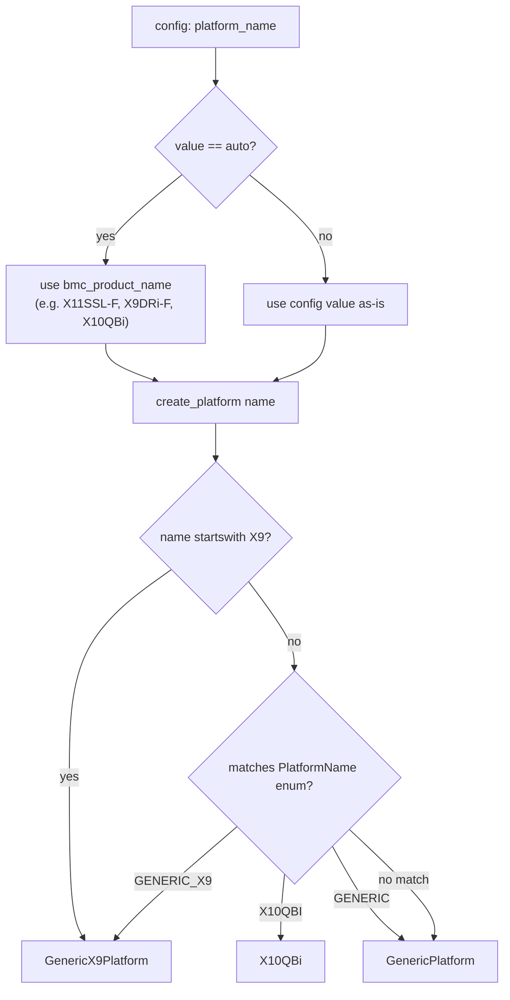
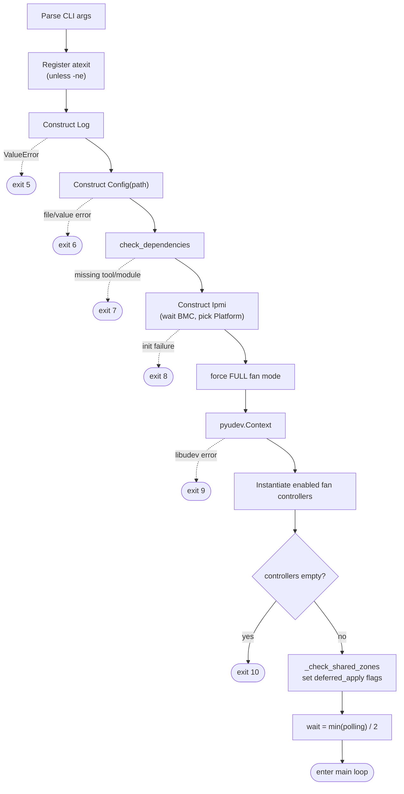
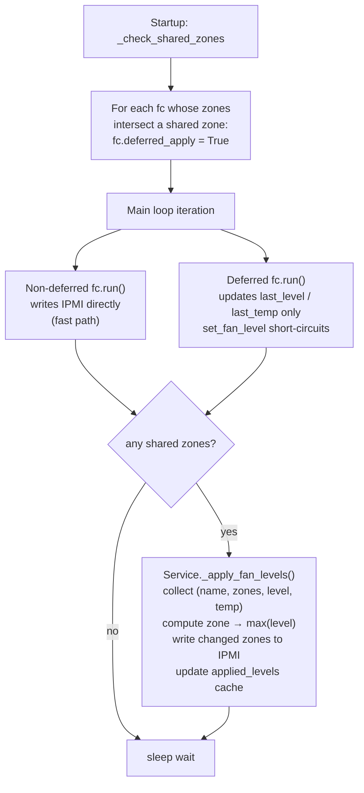
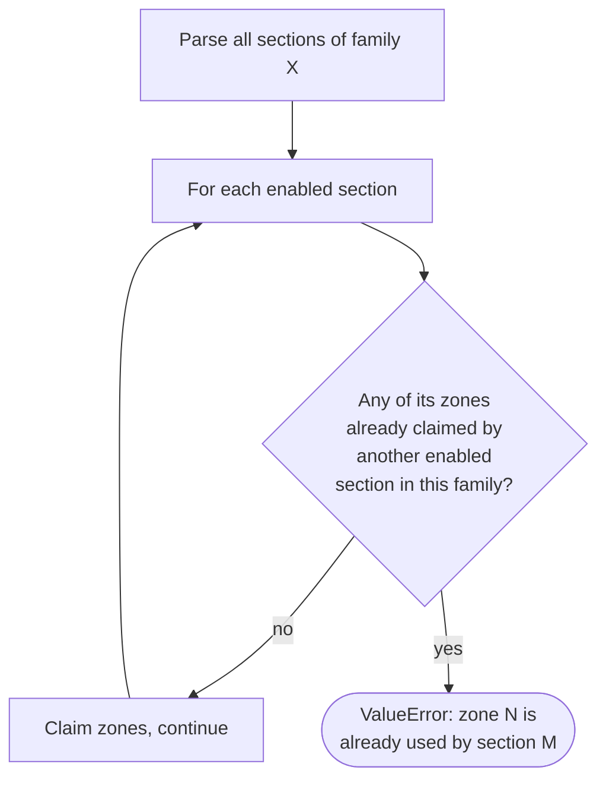
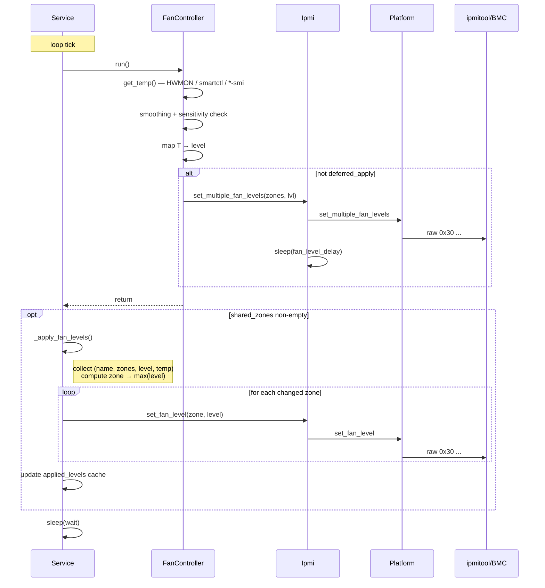

# smfc — Architecture

This document describes the internal structure and runtime behavior of `smfc`
(Supermicro fan control for Linux). It is aimed at contributors and advanced
users who want to understand *how* the service is built rather than *how to
use* it (which is what `README.md` covers).

> Scope: the implementation under `src/smfc/`. Helper scripts (`bin/`),
> packaging metadata (`debian/`, `pyproject.toml`), Docker artifacts, and the
> test suite are out of scope here.

---

## 1. High-level picture

`smfc` is a long-running `systemd` service that:

1. parses an INI configuration file,
2. talks to the BMC through `ipmitool` (locally or remote via LAN),
3. periodically reads temperatures from kernel HWMON files / `smartctl` /
   `nvidia-smi` / `rocm-smi`,
4. computes a fan duty-cycle (0..100%) using a user-defined piecewise-linear
   control function, and
5. writes the duty-cycle back to each configured IPMI zone via vendor-specific
   `ipmitool raw` commands.

The runtime is a single thread driven by a `time.sleep`-based main loop —
there is no `asyncio`, no worker pool, no IPC.



---

## 2. Source tree

```
src/smfc/
├── __init__.py           Public re-exports of all classes used in tests / API
├── cmd.py                main() entry point → Service().run()
├── service.py            Service — process lifecycle, main loop, arbitration
├── config.py             Config + per-controller dataclasses (typed view of INI)
├── log.py                Log — log-level/output routing (stdout/stderr/syslog)
├── ipmi.py               Ipmi — wraps ipmitool, owns Platform instance
├── platform.py           Platform ABC, FanMode enum, PlatformName enum
├── platform_factory.py   create_platform() — selects implementation by name/BMC
├── generic.py            GenericPlatform — X10/X11/X12/X13/H10-H13 IPMI raw
├── genericx9.py          GenericX9Platform — X9 IPMI raw (different opcodes)
├── x10qbi.py             X10QBi — Nuvoton NCT7904D variant
├── fancontroller.py      FanController base (temperature-driven) + Protocol
├── cpufc.py              CpuFc — Intel coretemp / AMD k10temp source
├── hdfc.py               HdFc  — SATA/SAS HDD/SSD source (+ Standby Guard)
├── nvmefc.py             NvmeFc — NVMe HWMON source
├── gpufc.py              GpuFc  — Nvidia/AMD GPU source via SMI tools
└── constfc.py            ConstFc — constant-level controller (no temp source)
```

Files installed but not part of the Python package:

| File                       | Purpose                                          |
|----------------------------|--------------------------------------------------|
| `config/smfc.conf`         | Default INI shipped with the package             |
| `config/smfc`              | `/etc/default/smfc` — environment for systemd    |
| `config/smfc.service`      | systemd unit                                     |
| `config/samples/*.conf`    | Example configurations                            |

---

## 3. Class diagram



Key relationships:

- `Service` owns one `Config`, one `Log`, one `Ipmi`, and an ordered list of
  fan controllers (`controllers: List[Union[FanController, ConstFc]]`).
- `Ipmi` owns exactly one `Platform` instance, selected once at startup.
- Every fan controller carries a back-reference to its parsed config dataclass
  (typed via the `FanControllerConfig` Protocol for the temperature-driven
  ones).
- `ConstFc` is intentionally **not** a `FanController` subclass — it has no
  temperature source. It only duck-types the attributes `Service` needs:
  `name`, `config.ipmi_zone`, `last_level`, `last_temp`, `deferred_apply`,
  `run()`.

---

## 4. Configuration layer (`config.py`)

`Config.__init__(path)` is the single source of truth for "what does the user
want":

1. Reads the INI file via `configparser.ConfigParser`.
2. Builds an `IpmiConfig` dataclass from `[Ipmi]`.
3. For each controller family (`CPU`, `HD`, `NVME`, `GPU`, `CONST`) it scans
   the configuration for the base section (e.g. `[CPU]`) **plus** all numbered
   variants (`[CPU:0]`, `[CPU:1]`, …). Each section yields its own dataclass
   instance — this is how *multiple fan curves per controller type* are
   supported.
4. For each family, `_validate_no_duplicate_zones()` ensures that no two
   *enabled* instances of the same family share an IPMI zone (one CPU curve
   per zone, one HD curve per zone, …).

Parsed result on the `Config` object:

```python
config.ipmi   : IpmiConfig
config.cpu    : List[CpuConfig]
config.hd     : List[HdConfig]
config.nvme   : List[NvmeConfig]
config.gpu    : List[GpuConfig]
config.const  : List[ConstConfig]
```

All defaults (`DV_*`) and string keys (`CV_*`, `CS_*`) live as class constants
on `Config` so the rest of the code never deals with raw INI strings.

Validation policy:

- *Range* checks happen here (e.g. `min_temp < max_temp`, `level ∈ [1..100]`,
  `temp_calc ∈ {0,1,2}`, `ipmi_zone ∈ [0..100]`, `polling ≥ 0`).
- *Existence/reachability* checks (device files, hwmon paths, external
  commands) happen later in `Service.check_dependencies()` and in each
  controller's constructor — i.e. after config parsing but before the main
  loop starts.

`parse_control_function()` handles the advanced `control_function=` syntax
(see §10.5). When the key is absent the section parser synthesizes an
equivalent 2-point list from the four legacy keys and stores it in
`config.control_function`, so `FanController.build_lut()` always consumes
`config.control_function` — it never reads `min_temp` / `max_temp` /
`min_level` / `max_level` directly.

---

## 5. Logging (`log.py`)

`Log` is a thin layer over `print`/`syslog.syslog`. At construction it picks
one of three writer methods (`msg_to_stdout`, `msg_to_stderr`, `msg_to_syslog`)
and stores it as `self.msg` — so callers always use `log.msg(level, text)`
without conditionals.

Levels: `NONE=0`, `ERROR=1`, `CONFIG=2`, `INFO=3`, `DEBUG=4`.
A message is emitted only if `level <= self.log_level`.

---

## 6. IPMI + platform abstraction

### 6.1 `Ipmi` class

`Ipmi` is the only place that spawns `ipmitool`. It:

- waits up to `BMC_INIT_TIMEOUT = 120 s` for the BMC to become responsive
  (5-second retry loop around `ipmitool sdr`) — covers the cold-boot case
  where Linux finishes booting before the BMC is ready to answer,
- parses `ipmitool bmc info` into `bmc_*` attributes,
- selects the appropriate `Platform` implementation,
- forces the BMC into manual-mode (`platform.set_fan_manual_mode()`),
- exposes `get_fan_mode`, `set_fan_mode`, `get_fan_level`,
  `set_fan_level`, `set_multiple_fan_levels` — all delegating to the
  `Platform`.

Every `set_*` call sleeps for `fan_mode_delay` or `fan_level_delay`
afterwards, giving the BMC and the fans time to react before the next
command. Negative delays are rejected at startup.

### 6.2 Platform selection



This means *auto-detection is purely string-prefix matching against the BMC
product name*. Boards whose names start with `X9` get the X9 platform;
everything else (X10, X11, X12, X13, H1x, …) gets the generic platform.
X10QBi must be opted into explicitly via `platform_name=X10QBi`.

### 6.3 Platform implementations

Each platform encodes vendor-specific `ipmitool raw` commands and zone/level
encodings:

| Platform            | Fan-level opcode                                   | Notes                                            |
|---------------------|----------------------------------------------------|--------------------------------------------------|
| `GenericPlatform`   | `raw 0x30 0x70 0x66 0x01 zone level`               | Level in %, 0x00–0x64                            |
| `GenericX9Platform` | `raw 0x30 0x91 0x5a 0x03 reg duty`                 | Zone → reg (0x10+zone), level *255/100         |
| `X10QBi`            | `raw 0x30 0x91 0x5c 0x03 reg duty` + TMFR setup    | Nuvoton NCT7904D, requires extra register setup |

`set_fan_manual_mode()` is a no-op on the generic platforms; on `X10QBi` it
programs the chip's temperature-to-fan mapping registers (T1FMR–T10FMR) and
sets PWM output mode (FOMC). It is called once during `Ipmi` init and once
per `set_fan_level` / `set_multiple_fan_levels` on X10QBi (the chip can
drift back to SmartFan mode on its own).

---

## 7. Fan controllers

### 7.1 Temperature-driven controllers — `FanController` base

`FanController` is **abstract by convention**: subclasses are responsible for
populating `self.config` *before* calling `super().__init__()` because the
base constructor immediately calls `get_temp()` to fail fast on a broken
sensor.

State on a `FanController`:

| Attribute        | Meaning                                                                |
|------------------|------------------------------------------------------------------------|
| `config`         | Typed config dataclass (CpuConfig / HdConfig / NvmeConfig / GpuConfig) |
| `name`           | Section name (e.g. `"CPU"`, `"HD:1"`) — used in log messages           |
| `count`          | Number of monitored devices                                            |
| `hwmon_path[]`   | One HWMON path per device, or `""` for fallback (smartctl)             |
| `temp_step`      | `(max_temp - min_temp) / steps` — legacy staircase tread width (C); kept for log output |
| `level_step`     | `(max_level - min_level) / steps` — legacy staircase tread height (%); kept for log output |
| `levels_lut`     | 101-element `List[int]` built by `build_lut()` at init; `levels_lut[T]` = fan level for temperature T°C |
| `last_time`      | Last poll timestamp (`time.monotonic`)                                 |
| `last_temp`      | Last smoothed temperature                                              |
| `last_level`     | Last applied fan level (0 = "no level set yet")                        |
| `_temp_history`  | `deque(maxlen=smoothing)` — moving-average window                      |
| `deferred_apply` | If True, controller stores its desired level but doesn't talk to IPMI  |

#### 7.1.1 Subclass responsibilities

Each subclass only builds `self.hwmon_path[]` and (optionally) overrides
`_get_nth_temp(index)` and/or `callback_func()`:

| Subclass | Temperature source                                            | Notes                                                  |
|----------|---------------------------------------------------------------|--------------------------------------------------------|
| `CpuFc`  | `coretemp` (Intel) or `k10temp` (AMD) via udev → HWMON        | Multi-CPU systems: one entry per package               |
| `HdFc`   | Per-disk HWMON (`drivetemp`); empty path → `smartctl -a`      | Validates against NVMe device names; runs Standby Guard |
| `NvmeFc` | Per-device HWMON (NVMe driver)                                | Empty hwmon path is treated as a hard error            |
| `GpuFc`  | `nvidia-smi --query-gpu=temperature.gpu` or `rocm-smi -t`     | Caches result for `polling` seconds across N indices    |

#### 7.1.2 Control function

The mapping temperature → fan level is represented at runtime as a
101-element lookup table `levels_lut`, built once during `__init__` by
`FanController.build_lut(config)`. The index is the integer temperature in °C
(0–100); the value is the fan level in % (0–100).

Two configuration styles feed into the same LUT (see §10.5 for the full
algorithm):

- **Legacy** (`min_temp` / `max_temp` / `min_level` / `max_level`): produces a
  staircase of `steps` equal-width treads via `create_legacy_lut()`.
- **Advanced** (`control_function = T1-L1, T2-L2, …`): produces a
  piecewise-linear curve digitalized into `steps + 2` plateaus via
  `create_control_function()`.

The shape of the resulting output — a staircase that rises from the minimum to
the maximum fan level — is the same in both cases:

```
       level (%)
         max_level ─────────────────────────────┐ ┌──────
                                                │ │
                                  ┌─────────────┘ │
                                  │
                              ┌───┘
                          ┌───┘
                      ┌───┘
                  ┌───┘
        min_level ┘
                  ┌───────┬───────┬───────┬───────┬──────▶ temperature (C)
              t_first                            t_last
                  ◀────────── plateaus (steps or steps+2) ─▶
```

`run()` semantics, every iteration of the service main loop:


The **sensitivity gate** is critical: it prevents the controller from
chattering on sub-degree fluctuations. The **smoothing window** further
dampens noisy sensors (e.g. brief load spikes on a CPU).

#### 7.1.3 Aggregation across multiple devices

When `count > 1` (multiple CPUs, multiple disks, multiple GPUs), `get_temp()`
collects all per-device temperatures and reduces them with one of:

- `CALC_MIN` — coolest sensor (rare; mostly for testing)
- `CALC_AVG` — average (default)
- `CALC_MAX` — hottest sensor (recommended for thermal safety)

### 7.2 Constant controller — `ConstFc`

`ConstFc` doesn't compute a level — its only job is to keep a configured fan
level applied to one or more zones. Its `run()`:

1. honors `polling` (default 30 s),
2. if `deferred_apply` is set, just stores `last_level = config.level` and
   returns (so the `Service` arbitrator can see it),
3. otherwise: for each owned zone, reads the current level and only writes if
   the BMC drifted from the configured value.

The "verify before write" pattern is important — it avoids spamming the BMC
once steady state is reached.

---

## 8. Service lifecycle (`service.py`)

### 8.1 Startup

`Service.run()` is the only externally invoked entry point. Steps with their
exit codes on failure:



Important: between every controller construction the service sleeps for
`ipmi.fan_level_delay` (default 2 s). Each controller's `__init__` may call
`get_temp()`, which on `HdFc` can fan out to many `smartctl` calls — startup
time grows linearly with disk count.

### 8.2 Main loop

```python
while True:
    for fc in self.controllers:
        fc.run()
    if self.shared_zones:
        self._apply_fan_levels()
    time.sleep(wait)
```

- `wait = min(polling)/2` — a Nyquist-style choice so the fastest controller
  is sampled at most one half-polling-interval late.
- Each `fc.run()` is internally rate-limited by its own `polling`, so the
  outer loop firing more often than a controller's `polling` is harmless.

### 8.3 Shutdown

`Service.exit_func` is registered with `atexit` (unless `-ne` was passed). On
process exit — including most exceptions — it sets all fans back to **100%**
via `ipmi.set_fan_mode(FULL_MODE)`. This is intentionally aggressive: a
crashed `smfc` leaves the system noisy but cool, never silent and hot. The
function unregisters itself afterwards so a second exit path doesn't reissue
the IPMI command.

---

## 9. Shared IPMI zone arbitration

This is the trickiest piece of the architecture and deserves its own section.

### 9.1 Why it exists

The user can point any combination of CPU/HD/NVME/GPU/CONST controllers at
any IPMI zone. If two *different* controller types end up writing to the
same zone, they would fight each other on every poll. The arbiter solves
this by enforcing one global rule per shared zone:

> **The highest desired level wins.**

This is correct from a thermal-safety perspective — the loudest cry for
cooling overrides quieter ones.

### 9.2 How it works



### 9.3 Cache and logging

- `applied_levels: Dict[int, int]` caches what was last written per zone so
  the arbiter never re-issues an identical IPMI command.
- `last_desired` caches the previous arbitration input, so at DEBUG level
  the arbiter only logs when the inputs change.
- When a zone has multiple contributors, the INFO log line names the
  *winner* and lists *losers* with their per-controller temperatures, which
  makes triage of "why is my zone louder than I expected" straightforward.

### 9.4 Multiple fan curves per controller family

A related but *opposite* feature: the user can define more than one
controller of the **same family** (e.g. `[HD]` + `[HD:1]`) to apply
different fan curves to different IPMI zones. Two HD curves with the same
parameters but different zone assignments would be pointless — the value is
in per-zone *tuning* (different disk sets, different airflow,
different temperature targets).

`Config._get_sections()` collects `[HD]`, `[HD:0]`, `[HD:1]`, … in numeric
order and produces one `HdConfig` per section. `Service.run()` then
instantiates one `HdFc` per enabled config.

Example: front backplane vs. rear cage on the same chassis, controlled
independently:

```ini
[HD]                    ; front backplane → zone 1
ipmi_zone   = 1
hd_names    = /dev/disk/by-id/ata-front-1 /dev/disk/by-id/ata-front-2
min_temp    = 32
max_temp    = 46

[HD:1]                  ; rear cage, hotter, less airflow → zone 2
ipmi_zone   = 2
hd_names    = /dev/disk/by-id/ata-rear-1 /dev/disk/by-id/ata-rear-2
min_temp    = 30
max_temp    = 42
sensitivity = 1.0
```

**Parse-time invariant**: `Config._validate_no_duplicate_zones()` rejects
two *enabled* sections of the same family that target the same zone:



The rule is *deliberately strict*: there is no arbitration logic for
same-family clashes, so two HD curves are not allowed to fight over one
zone. The rule does not apply across families (that is what §9.1–9.3 are
for), and it does not apply to *disabled* sections.

---

## 10. Special features

### 10.1 Standby Guard (`HdFc.run_standby_guard`)

Optional, opt-in feature for RAID arrays of SATA disks. Goal: when *enough*
disks in the array have spun down to STANDBY, force the remaining ones down
too — so the whole array stays parked together, rather than one busy disk
keeping the rest spinning.

Implemented as a `callback_func()` invoked at the start of every `HdFc.run()`
poll. It:

1. issues `smartctl -i -n standby <dev>` per disk to read power state without
   waking the disk,
2. transitions array state ACTIVE → STANDBY (and parks active members with
   `smartctl -s standby,now`) when the count of standby disks crosses
   `standby_hd_limit`,
3. transitions STANDBY → ACTIVE when any disk wakes up.

Disabled automatically when `count == 1`.

### 10.2 Temperature smoothing

Each controller keeps a `deque(maxlen=smoothing)` of raw readings; `run()`
uses the deque's mean instead of the latest reading. `smoothing=1` (default)
means no smoothing. Higher values trade responsiveness for stability — set
this to 3..5 if you see fan oscillation on a noisy sensor.

### 10.3 Sensitivity threshold

A change is only acted on when
`|new_smoothed_temp - last_temp| ≥ config.sensitivity`. This is a deadband,
not a hysteresis: the threshold is symmetric and applies both ways. Without
it, the staircase mapping would still cause a fan-level change on every
crossing of a tread boundary, even for thermally-irrelevant fluctuations.

### 10.4 HWMON → smartctl fallback (HD only)

`HdFc` collects an HWMON path per disk via udev. SAS/SCSI disks have no
`drivetemp` entry, so their path comes back as `""`. `HdFc._get_nth_temp`
treats an empty path as a signal to invoke `smartctl -a <dev>` and parse the
output — supporting both SCSI ("Current Drive Temperature:") and ATA
("Temperature_Celsius" SMART attribute) reporting styles. This means a
single `[HD]` section can mix SATA and SAS disks transparently.

### 10.5 Piecewise-linear control function (`control_function=`)

`FanController.build_lut(config)` is the single dispatch point that produces
the 101-element `levels_lut` for any controller at startup:

```python
if config.control_function:
    return create_control_function(config.control_function, config.steps)
return create_legacy_lut(config.min_temp, config.max_temp,
                         config.min_level, config.max_level, config.steps)
```

Because the section parser always populates `config.control_function` — either
from an explicit `control_function=` key or synthesized from the four legacy
keys — `build_lut` always takes the first branch in practice.

#### Algorithm: `create_control_function(pairs, steps)`

Input: a validated list of `(T, L)` breakpoints (≥ 2, strictly ascending T,
all values in 0–100) and a `steps` count.

**Step 1 — per-degree linear interpolation.**
Walk each segment `(T_i, L_i) → (T_{i+1}, L_{i+1})`, filling `levels[T_i ..
T_{i+1}−1]` with `round(L_i + offset × (L_{i+1} − L_i) / dt)`. Pad the head
(`[0..t_first−1]`) with `l_first` and the tail (`[t_last..100]`) with
`l_last`.

**Step 2 — interior digitalization.**
Divide the interior `[t_first+1 .. t_last−1]` into `steps` equal-width
sub-intervals (the last `interior_len % steps` intervals get one extra degree
to absorb the remainder). Replace each sub-interval with its rounded average,
producing `steps` flat plateaus.

**Step 3 — endpoint pinning.**
Write `levels[t_first] = l_first` and `levels[t_last] = l_last` exactly.
Step 2 does not touch the endpoints (the interior range is exclusive of both);
these writes are a clarity guarantee, not a correction.

Result: `steps + 2` plateaus total — 1 pinned at `t_first`, `steps` in the
interior, 1 pinned at `t_last`. Only the two endpoints are guaranteed exact;
interior plateau values are averages of the underlying linear curve.

#### Validation chain

| Check | Location |
|---|---|
| Syntactic: ≥ 2 pairs, each `T-L`, both integers | `Config.parse_control_function()` |
| Range: T ∈ [0..100], L ∈ [0..100] | `Config.parse_control_function()` |
| Monotonicity: temperatures strictly ascending | `Config.parse_control_function()` |
| Interior range: `(t_last − t_first − 1) ≥ steps` | `Config._validate_fan_controller_config()` |
| Mutual exclusion with legacy keys | Section parser (`_parse_*_sections`) |
| Legacy → canonical synthesis when absent | Section parser (`_parse_*_sections`) |

`control_function=` and any of `min_temp=` / `max_temp=` / `min_level=` /
`max_level=` in the same section raises `ValueError` at parse time — the two
forms are mutually exclusive by design.

---

## 11. Execution-order summary

```
main()                                          (cmd.py)
└── Service().run()                             (service.py)
    ├── _parse_args()
    ├── atexit.register(exit_func)
    ├── Log(level, output)                      (log.py)
    ├── Config(path)                            (config.py)
    │   ├── _parse_ipmi
    │   ├── _parse_*_sections (×5)
    │   └── _validate_no_duplicate_zones (×5)
    ├── check_dependencies()
    ├── Ipmi(log, config.ipmi, sudo)            (ipmi.py)
    │   ├── _exec_ipmitool(["sdr"]) loop        — wait for BMC
    │   ├── _exec_ipmitool(["bmc","info"])
    │   ├── create_platform(...)                (platform_factory.py)
    │   └── platform.set_fan_manual_mode()
    ├── ipmi.set_fan_mode(FULL)
    ├── pyudev.Context()
    ├── for cfg in config.cpu / hd / nvme / gpu / const if cfg.enabled:
    │     instantiate fan controller (calls get_temp once)
    ├── _check_shared_zones()                   — mark deferred_apply
    └── loop forever:
        ├── fc.run() for each fc
        │     └── may emit ipmitool raw via Ipmi.set_*_fan_level(s)
        ├── _apply_fan_levels() (if shared_zones)
        └── time.sleep(wait)
```

---

## 12. Data flow per cooling iteration (sequence)



---

## 13. Special architectural considerations

Non-obvious behaviors and design choices that have caused (or could cause)
confusion when reading the code.

### 13.1 `deferred_apply` is decided once at startup

It is set during `Service.run()` after all controllers exist, based on
config-time zone assignment. There is no mechanism to add/remove
controllers at runtime; SIGHUP-style config reload is not implemented.
Changing the config requires a service restart.

### 13.2 BMC initialization timeout is 120 s

If the BMC needs longer than 2 minutes to become responsive (cold boot of
some boards), `Ipmi.__init__` gives up and the service exits with code 8.
`systemd` will normally restart it — the next attempt usually succeeds.

### 13.3 X10QBi re-applies manual mode on every fan write

The Nuvoton NCT7904D on X10QBi tends to drift back into SmartFan mode, so
both `set_fan_level()` and `set_multiple_fan_levels()` call
`set_fan_manual_mode()` first. This is a deliberate but expensive choice:
each level write incurs 11 extra `ipmitool raw` calls.

### 13.4 Polling intervals and the outer loop

`wait = min(polling) / 2` means a `[CONST]` with the default `polling=30`
combined with a `[CPU]` with `polling=2` results in a 1-second main loop,
which is fine. But misconfiguring all controllers to `polling=0.1` would
cause near-busy-spin and high ipmitool traffic. There is no minimum-bound
enforcement.

### 13.5 No locking around BMC access

There is only one thread, so this is safe today. If anyone introduces
concurrency in the future, *every* `Ipmi` method assumes it is the sole
caller — the `time.sleep(fan_level_delay)` after each write is the only
synchronization with the BMC and is not thread-safe.

### 13.6 Fan-mode fall-back at exit

`exit_func` calls `ipmi.set_fan_mode(FULL_MODE)`, which (1) puts the BMC
back into FULL mode and (2) brings fans to 100% on most boards. On a board
that doesn't auto-100% in FULL mode, fans may stay at whatever the last
written duty cycle was. This is rare but worth knowing when investigating
"my fans didn't spin up after smfc crashed".

### 13.7 GPU SMI calls are batched across indices

`GpuFc._get_nth_temp(i)` runs `nvidia-smi`/`rocm-smi` once per `polling`
interval and caches the *full* per-GPU temperature list. The `i` argument
just indexes into that cache. This is why GPU polling is per-controller,
not per-device — and why the SMI tool is invoked only once even when
monitoring multiple GPUs.

### 13.8 First-poll behavior

`last_time = monotonic() - (polling + 1)` in the base controller
constructor: this forces the first `run()` call to actually poll, regardless
of how soon after startup it happens. Without this, the first iteration
would be a no-op and the fans would sit at the BMC's default level until
the first elapsed polling interval.

### 13.9 `last_level == 0` is treated as "not initialized"

`Service._collect_desired_levels` filters out controllers with
`last_level <= 0`, meaning a brand-new controller that hasn't completed a
full poll cycle does not participate in arbitration. This avoids a race
where a deferred controller wins a zone with a stale `0%` desired level on
the first iteration.

---

## 14. Where to look next

- `test/test_*.py` — unit tests structured per source file; the
  `MockDevices` / `factory_mockdevice` helpers in `test/test_data.py`
  illustrate how the udev path is exercised without real hardware.
- `config/samples/*.conf` — eight canonical configurations covering the
  common deployment shapes (CPU-only, HD-only, mixed, multi-curve, GPU,
  CONST-only, X9, X10QBi).
- `README.md` chapters 6 (IPMI thresholds), 10 (configuration), 11 (run).
- `DEVELOPMENT.md` for the contributor workflow.
