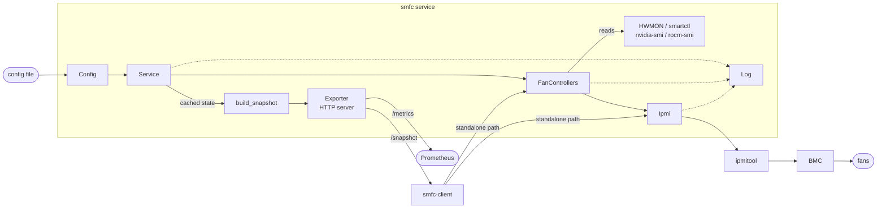
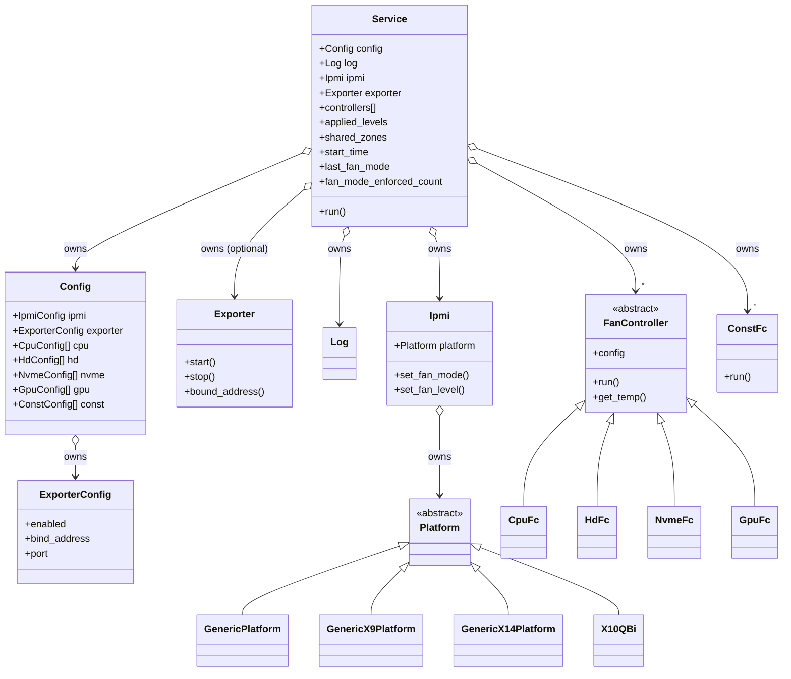
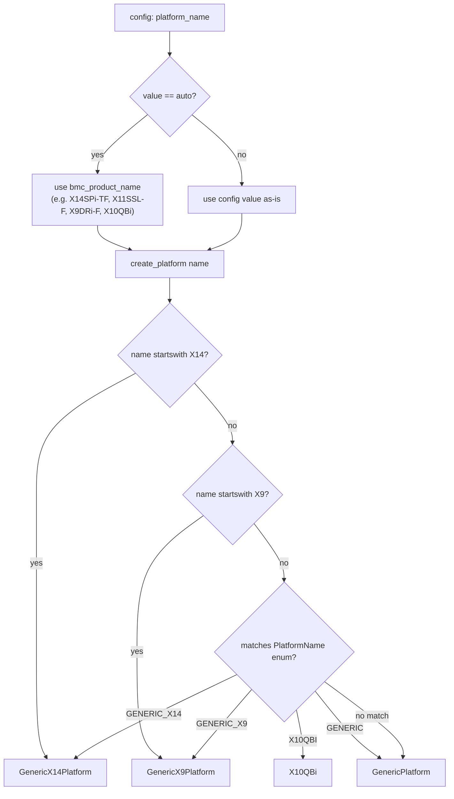
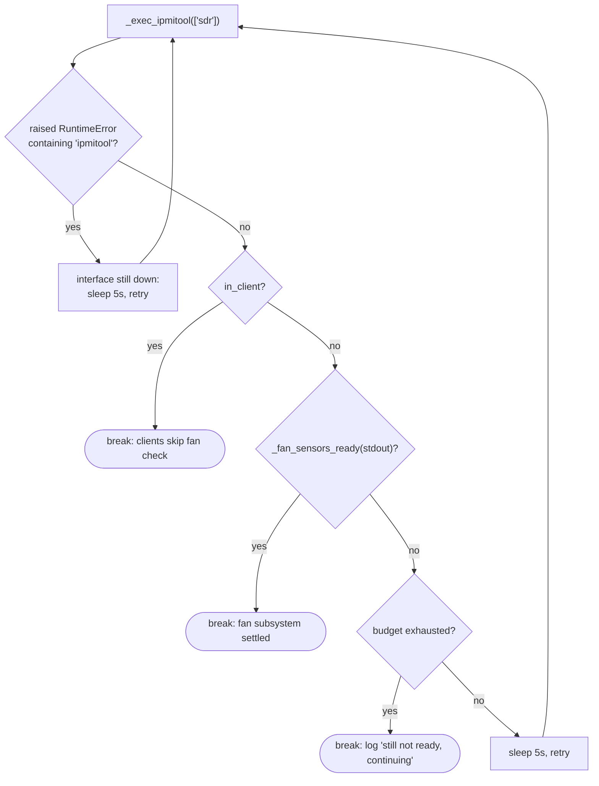
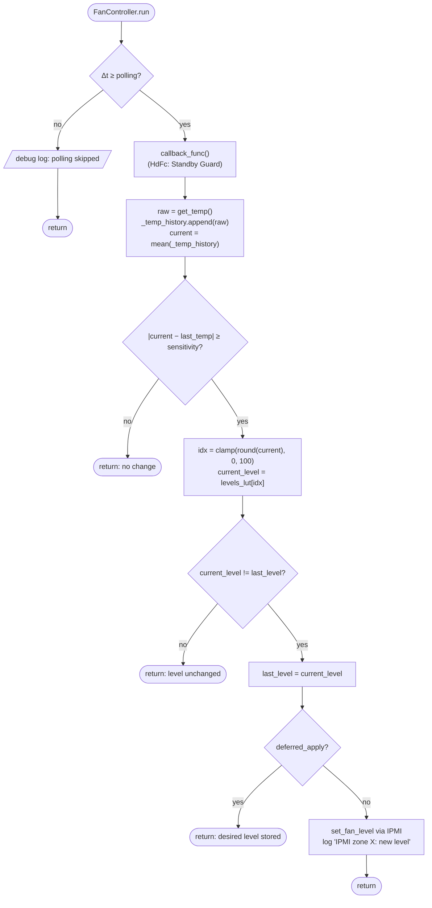
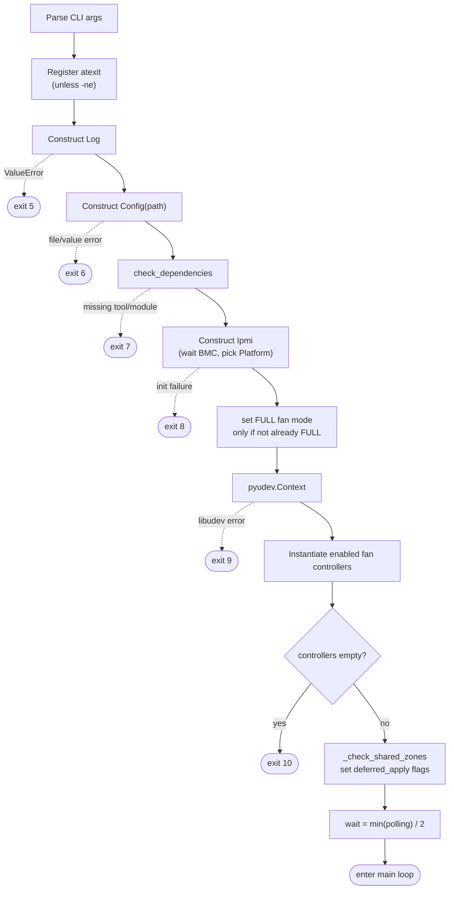
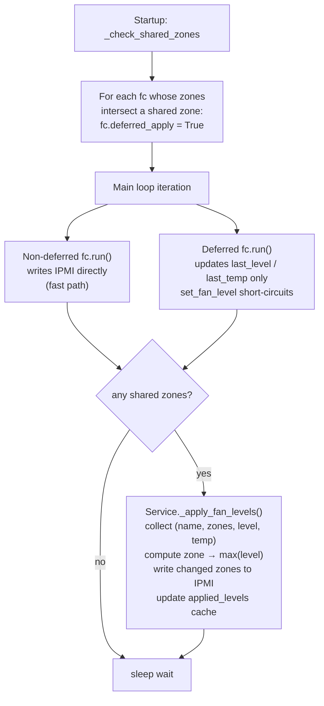
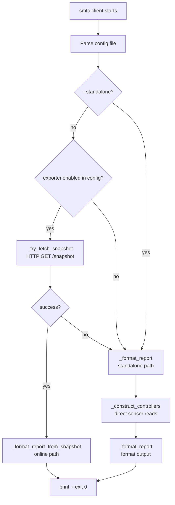
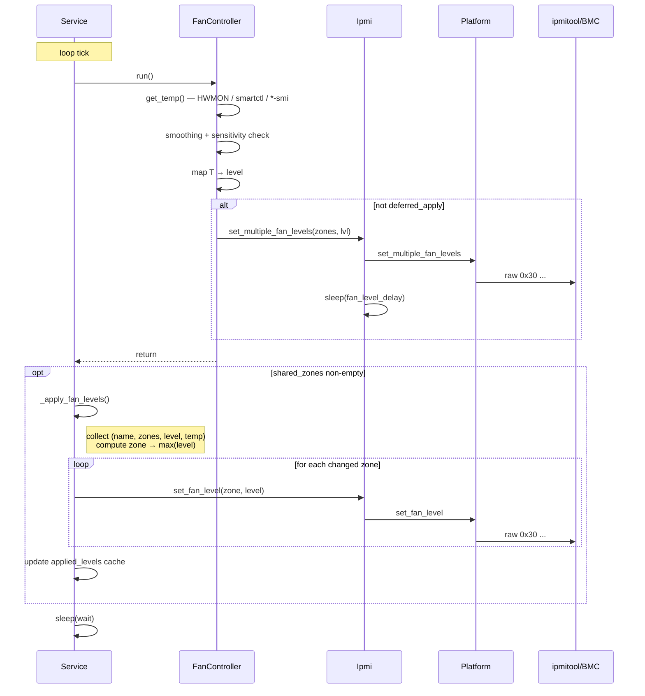
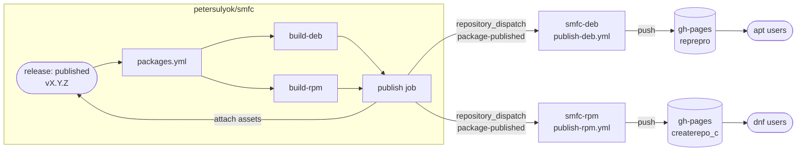

# smfc — Architecture

This document describes the internal structure and runtime behavior of `smfc`
(Supermicro fan control for Linux). It is aimed at contributors and advanced
users who want to understand *how* the service is built rather than *how to
use* it (which is what `README.md` covers).

> Scope: the implementation under `src/smfc/`. Helper scripts (`bin/`),
> packaging metadata (`debian/`, `pyproject.toml`), Docker artifacts, and the
> test suite are out of scope here.

---

## 1. High-level picture

`smfc` is a long-running `systemd` service that:

1. parses an INI configuration file,
2. talks to the BMC through `ipmitool` (locally or remote via LAN),
3. periodically reads temperatures from kernel HWMON files / `smartctl` /
   `nvidia-smi` / `rocm-smi`,
4. computes a fan duty-cycle (0..100%) using a user-defined piecewise-linear
   control function, and
5. writes the duty-cycle back to each configured IPMI zone via vendor-specific
   `ipmitool raw` commands.

The runtime is a single thread driven by a `time.sleep`-based main loop —
there is no `asyncio`, no worker pool, no IPC.



---

## 2. Source tree

```
src/smfc/
├── __init__.py           Public re-exports of all classes used in tests / API
├── cmd.py                main() entry point → Service().run()
├── service.py            Service — process lifecycle, main loop, arbitration
├── config.py             Config + per-controller dataclasses (typed view of INI)
├── log.py                Log — log-level/output routing (stdout/stderr/syslog)
├── ipmi.py               Ipmi — wraps ipmitool, owns Platform instance
├── platform.py           Platform ABC, FanMode enum, PlatformName enum
├── platform_factory.py   create_platform() — selects implementation by name/BMC
├── generic.py            GenericPlatform — X10/X11/X12/X13/H10-H13 IPMI raw
├── genericx9.py          GenericX9Platform — X9 IPMI raw (different opcodes)
├── genericx14.py         GenericX14Platform — X14 OpenBMC IPMI raw (OEM per-zone manual mode)
├── x10qbi.py             X10QBi — Nuvoton NCT7904D variant
├── fancontroller.py      FanController base (temperature-driven) + Protocol
├── cpufc.py              CpuFc — Intel coretemp / AMD k10temp source
├── hdfc.py               HdFc  — SATA/SAS HDD/SSD source (+ Standby Guard)
├── nvmefc.py             NvmeFc — NVMe HWMON source
├── gpufc.py              GpuFc  — Nvidia/AMD GPU source via SMI tools
├── constfc.py            ConstFc — constant-level controller (no temp source)
├── snapshot.py           build_snapshot() — serialize live service state to JSON
├── exporter.py           Exporter — HTTP server for /snapshot, /metrics, /healthz
└── client.py             smfc-client — one-shot status report (online or standalone)
```

Files installed but not part of the Python package:

| File                       | Purpose                                          |
|----------------------------|--------------------------------------------------|
| `config/smfc.conf`         | Default INI shipped with the package             |
| `config/smfc`              | `/etc/default/smfc` — environment for systemd    |
| `config/smfc.service`      | systemd unit                                     |
| `config/samples/*.conf`    | Example configurations                            |

---

## 3. Class diagram



Key relationships:

- `Service` owns one `Config`, one `Log`, one `Ipmi`, and an ordered list of
  fan controllers (`controllers: List[Union[FanController, ConstFc]]`).
- `Ipmi` owns exactly one `Platform` instance, selected once at startup.
- Every fan controller carries a back-reference to its parsed config dataclass
  (typed via the `FanControllerConfig` Protocol for the temperature-driven
  ones).
- `ConstFc` is intentionally **not** a `FanController` subclass — it has no
  temperature source. It only duck-types the attributes `Service` needs:
  `name`, `config.ipmi_zone`, `last_level`, `last_temp`, `deferred_apply`,
  `run()`.

---

## 4. Configuration layer (`config.py`)

`Config.__init__(path)` is the single source of truth for "what does the user
want":

1. Reads the INI file via `configparser.ConfigParser`.
2. Builds an `IpmiConfig` dataclass from `[Ipmi]`.
3. For each controller family (`CPU`, `HD`, `NVME`, `GPU`, `CONST`) it scans
   the configuration for the base section (e.g. `[CPU]`) **plus** all numbered
   variants (`[CPU:0]`, `[CPU:1]`, …). Each section yields its own dataclass
   instance — this is how *multiple fan curves per controller type* are
   supported.
4. For each family, `_validate_no_duplicate_zones()` ensures that no two
   *enabled* instances of the same family share an IPMI zone (one CPU curve
   per zone, one HD curve per zone, …).

Parsed result on the `Config` object:

```python
config.ipmi   : IpmiConfig
config.cpu    : List[CpuConfig]
config.hd     : List[HdConfig]
config.nvme   : List[NvmeConfig]
config.gpu    : List[GpuConfig]
config.const  : List[ConstConfig]
```

All defaults (`DV_*`) and string keys (`CV_*`, `CS_*`) live as class constants
on `Config` so the rest of the code never deals with raw INI strings.

Validation policy:

- *Range* checks happen here (e.g. `min_temp < max_temp`, `level ∈ [1..100]`,
  `temp_calc ∈ {0,1,2}`, `ipmi_zone ∈ [0..100]`, `polling ≥ 0`).
- *Existence/reachability* checks (device files, hwmon paths, external
  commands) happen later in `Service.check_dependencies()` and in each
  controller's constructor — i.e. after config parsing but before the main
  loop starts.

`parse_control_function()` handles the advanced `control_function=` syntax
(see §11.2). When the key is absent `_read_control_function()` returns an
empty list and `config.control_function` stays empty; `FanController.build_lut()`
then falls back to `create_legacy_lut()` and reads `min_temp` / `max_temp` /
`min_level` / `max_level` directly. When `control_function=` is present it takes
precedence; any `min_temp` / `max_temp` / `min_level` / `max_level` keys in the
same section are ignored (and not validated).

---

## 5. Logging (`log.py`)

`Log` is a thin layer over `print`/`syslog.syslog`. At construction it picks
one of three writer methods (`msg_to_stdout`, `msg_to_stderr`, `msg_to_syslog`)
and stores it as `self.msg` — so callers always use `log.msg(level, text)`
without conditionals.

Levels: `NONE=0`, `ERROR=1`, `CONFIG=2`, `INFO=3`, `DEBUG=4`.
A message is emitted only if `level <= self.log_level`.

---

## 6. IPMI + platform abstraction

### 6.1 `Ipmi` class

`Ipmi` is the only place that spawns `ipmitool`. It:

- waits up to `BMC_INIT_TIMEOUT = 180 s` for the BMC *and its fan subsystem*
  to become ready (5-second retry loop around `ipmitool sdr`) — covers the
  cold-boot race where the IPMI command interface answers before fan-level
  writes actually hold (see §6.4),
- parses `ipmitool bmc info` into `bmc_*` attributes,
- selects the appropriate `Platform` implementation,
- calls `platform.start()` to prepare manual fan control (no-op on most platforms; enables per-zone manual mode on `GenericX14Platform`, programs NCT7904D registers on `X10QBi`),
- exposes `get_fan_mode`, `set_fan_mode`, `get_fan_level`,
  `set_fan_level`, `set_multiple_fan_levels` — all delegating to the
  `Platform`.

Every `set_*` call sleeps for `fan_mode_delay` or `fan_level_delay`
afterwards, giving the BMC and the fans time to react before the next
command. Negative delays are rejected at startup.

### 6.2 Platform selection



Auto-detection is purely string-prefix matching against the BMC product name.
Boards whose names start with `X14` get the X14 platform; boards starting with
`X9` get the X9 platform; everything else (X10, X11, X12, X13, H1x, …) gets
the generic platform. `X10QBi` must be opted into explicitly via
`platform_name=X10QBi`.

### 6.3 Platform implementations

Each platform encodes vendor-specific `ipmitool raw` commands and zone/level
encodings:

| Platform               | Fan-level opcode                                | Notes                                                    |
|------------------------|-------------------------------------------------|----------------------------------------------------------|
| `GenericPlatform`      | `raw 0x30 0x70 0x66 0x01 zone level`            | Level in %, 0x00–0x64                                    |
| `GenericX9Platform`    | `raw 0x30 0x91 0x5a 0x03 reg duty`              | Zone → reg (0x10+zone), level × 255/100                  |
| `GenericX14Platform`   | `raw 0x30 0x70 0x88 zone level`                 | Level in %, 0x00–0x64; manual mode via OEM `0x2c 0x04 0xcf 0xc2` per zone |
| `X10QBi`               | `raw 0x30 0x91 0x5c 0x03 reg duty` + TMFR setup| Nuvoton NCT7904D, zone → 0x10+zone, level × 255/100      |

`start()` is called once during `Ipmi` init; `end()` is called once at
shutdown via `Service.exit_func()`:

- `GenericPlatform` and `GenericX9Platform`: both `start()` and `end()` are no-ops.
- `GenericX14Platform`: `start()` enables per-zone manual mode for all 6 zones via
  OEM command `0x2c 0x04 0xcf 0xc2`; `end()` disables it, restoring automatic BMC
  fan control.
- `X10QBi`: `start()` programs the NCT7904D temperature-to-fan mapping registers
  (T1FMR–T10FMR) and sets PWM output mode (FOMC); `end()` is a no-op (configuration
  persists until BMC restart). `start()` is also re-invoked before each `set_fan_level` /
  `set_multiple_fan_levels` call because the chip can drift back to SmartFan mode on its own.

### 6.4 Cold-boot BMC readiness gate (`Ipmi._fan_sensors_ready`)

On a cold power-on the IPMI command interface comes up **well before** the fan
subsystem has settled. During that gap the BMC answers `ipmitool` commands
normally, yet silently forces every fan to 100% and ignores fan-level writes.
If `smfc` starts the control loop inside this window, a low-polling zone can
latch at 100% until its next poll — for the HD zone (`polling = 960 s`) that is
up to 16 minutes of full-speed fans. This was the original cold-boot bug the
gate fixes.

A cold power-on is the common trigger, but it is **not the only one**. The same
settling window opens after *any* event that re-initializes the BMC and its fan
subsystem: an explicit BMC cold reset (`ipmitool mc reset cold`), and — notably
— a change to **BIOS/BMC settings** (entering BIOS setup, altering fan-mode or
hardware-monitor options, or a BIOS/firmware update). In these cases the host
may already be running when the BMC restarts, so `smfc` can be restarted (or
started) with *no* OS-boot overlap to absorb the delay — the gate must then wait
out the full settling time on its own, which is why the 180 s budget is sized
for the worst-case ~102 s rather than the ~10–15 s tail seen on a normal boot.

**Measured timeline.** An `ipmitool mc reset cold` on an X11SCH-LN4F (which
resets only the BMC, host stays up — the same settling behavior as a cold boot,
minus the OS-boot overlap) exposes two distinct phases before the fans report
live data:

| Phase | Duration | `ipmitool sdr` | FAN rows |
|---|---|---|---|
| Command interface down | ~30 s | `rc != 0` (`Device or resource busy`) | — |
| Fan subsystem not settled | ~69 s | `rc = 0` | `no reading \| ns` |
| Settled | — | `rc = 0` | `1300–1500 RPM \| ok` |

Total ≈ 102 s of pure BMC settling. On a real power-on boot most of this
overlaps BIOS/POST/kernel/systemd startup, so by the time `smfc` runs the gate
typically only has to wait out the tail (~10–15 s observed).

**Observed across real triggers (X11SCH-LN4F).** Field testing confirmed why the
gate keys on the *state* column only: the sibling reading-column string tracks
whether the BMC genuinely re-initialized, not "boot vs reset", and even varies by
sensor type within one capture. The `ns` state is invariant across all of them.

| Trigger | BMC re-init? | Fan rows during window | Gate wait |
|---|---|---|---|
| Warm OS reboot | no (BMC stayed powered) | `disabled \| ns` | ~17 s |
| BIOS-change reboot | no (BMC stayed powered) | `disabled \| ns` | ~17 s |
| Full PSU-off cold start | **yes** | `no reading \| ns` (fans); `disabled \| ns` (other sensors) | ~12 s |
| `ipmitool mc reset cold` | yes | `no reading \| ns` | ~102 s |

A genuinely cold BMC reports fans as **`no reading`** (matching `mc reset cold`);
a host reboot that leaves the BMC powered reports **`disabled`** (sensor scanning
briefly suspended). Note that merely flipping a rear AC switch may *not* cold-start
the BMC — it runs on 5 V standby, so a brief cut can be absorbed by standby
capacitors, leaving the BMC (and its `FULL`/100% state) untouched; only a full PSU
power-down reliably re-initializes it. On every real boot the command interface was
already up when `smfc` started (no `rc != 0` phase — that only appears with an
in-band `mc reset cold`), and POST/boot absorbed most of the settling, so only a
~12–17 s tail remained. In every case the BMC came up already in `FULL` with both
zones at 100%, so the conditional startup set (§8.1) correctly skipped the redundant
write while the gate absorbed the remaining settling and zone levels applied without
a zone-1 clobber.

**Two-condition gate.** `Ipmi.__init__` (Check 3) loops until **both** hold,
sharing a single 180 s budget in 5 s steps:



- **(a) interface up** — `sdr` returns `rc = 0`. A non-zero rc raises
  `RuntimeError("ipmitool error …")`; the loop catches it (message contains
  `"ipmitool"`), sleeps, and retries — this is what rides out the ~30 s
  interface-down phase.
- **(b) fan subsystem settled** — `_fan_sensors_ready()` scans the `sdr`
  output for at least one `FAN*` sensor whose state column is **not** `ns`.

**Why read-only.** The gate never writes during the fragile window. A
write-readback probe would be self-defeating — writing a fan level mid-window
triggers the very 100% clobber it is trying to detect. A fixed sleep was
rejected as fragile (too short risks the bug, too long delays every boot). The
read-only `sdr` poll waits exactly as long as needed and no longer.

**Why the predicate is `state != "ns"`, not `state == "ok"`.** In ipmitool's
`lib/ipmi_sdr.c`, `ipmi_sdr_get_thresh_status()` returns `ns` **if and only
if** the sensor reading is invalid (`!s_reading_valid`). So the biconditional
holds: `ns` ⇔ no valid reading. Any other state — including the threshold
alarms `nc`/`cr`/`nr` (and their extended `lnc`/`unc`/`lcr`/`ucr`/`lnr`/`unr`
forms) — means the tachometer was actually read, i.e. the subsystem has
settled. A fan that boots straight into an alarm state must count as ready;
narrowing the check to `== "ok"` would re-hang on it until the timeout. The
sibling reading-column strings (`disabled`, `no reading`, `Not Readable`) are
never inspected — they always co-occur with `ns` and vary by board, trigger, and
even sensor type (on the same board a genuinely cold BMC shows `no reading` for
fans but `disabled` for other sensors, while a reboot that leaves the BMC powered
shows `disabled`), so keying on the state column keeps the gate board-agnostic. At least one `FAN*` sensor
is required so an unpopulated header that stays `ns` forever cannot hold the
gate open.

**Clients skip (b).** Read-only consumers (`smfc-client`) pass
`in_client=True` and a short `CLIENT_BMC_INIT_TIMEOUT = 5 s`: they never mutate
BMC state, so they must not block on a cold fan subsystem — they satisfy (a)
and return.

---

## 7. Fan controllers

### 7.1 Temperature-driven controllers — `FanController` base

`FanController` is **abstract by convention**: subclasses are responsible for
populating `self.config` *before* calling `super().__init__()` because the
base constructor immediately calls `get_temp()` to fail fast on a broken
sensor.

State on a `FanController`:

| Attribute        | Meaning                                                                |
|------------------|------------------------------------------------------------------------|
| `config`         | Typed config dataclass (CpuConfig / HdConfig / NvmeConfig / GpuConfig) |
| `name`           | Section name (e.g. `"CPU"`, `"HD:1"`) — used in log messages           |
| `count`          | Number of monitored devices                                            |
| `hwmon_path[]`   | One HWMON path per device, or `""` for fallback (smartctl)             |
| `temp_step`      | `(max_temp - min_temp) / steps` — legacy staircase tread width (C); kept for log output |
| `level_step`     | `(max_level - min_level) / steps` — legacy staircase tread height (%); kept for log output |
| `levels_lut`     | 101-element `List[int]` built by `build_lut()` at init; `levels_lut[T]` = fan level for temperature T°C |
| `last_time`      | Last poll timestamp (`time.monotonic`)                                 |
| `last_temp`      | Last smoothed temperature                                              |
| `last_level`     | Last applied fan level (0 = "no level set yet")                        |
| `_temp_history`  | `deque(maxlen=smoothing)` — moving-average window                      |
| `deferred_apply` | If True, controller stores its desired level but doesn't talk to IPMI  |

#### 7.1.1 Subclass responsibilities

Each subclass only builds `self.hwmon_path[]` and (optionally) overrides
`_get_nth_temp(index)` and/or `callback_func()`:

| Subclass | Temperature source                                            | Notes                                                  |
|----------|---------------------------------------------------------------|--------------------------------------------------------|
| `CpuFc`  | `coretemp` (Intel) or `k10temp` (AMD) via udev → HWMON        | Multi-CPU systems: one entry per package               |
| `HdFc`   | Per-disk HWMON (`drivetemp`); empty path → `smartctl -a`      | Validates against NVMe device names; runs Standby Guard |
| `NvmeFc` | Per-device HWMON (NVMe driver)                                | Empty hwmon path is treated as a hard error            |
| `GpuFc`  | `nvidia-smi --query-gpu=temperature.gpu` or `rocm-smi -t`     | Caches result for `polling` seconds across N indices    |

`HdFc` is the only subclass with a per-device fallback: SAS/SCSI disks have no
`drivetemp` entry, so their udev-discovered HWMON path comes back as `""`.
`HdFc._get_nth_temp` treats an empty path as a signal to invoke
`smartctl -a <dev>` and parses both SCSI (`Current Drive Temperature:`) and
ATA (`Temperature_Celsius` SMART attribute) output styles. A single `[HD]`
section can therefore mix SATA and SAS disks transparently.

#### 7.1.2 Control function

The mapping temperature → fan level is represented at runtime as a
101-element lookup table `levels_lut`, built once during `__init__` by
`FanController.build_lut(config)`. The index is the integer temperature in °C
(0–100); the value is the fan level in % (0–100).

Two configuration styles feed into the same LUT (see §11.2 for the full
algorithm):

- **Legacy** (`min_temp` / `max_temp` / `min_level` / `max_level`): produces a
  staircase of `steps + 1` equal-width treads via `create_legacy_lut()`.

  

- **Advanced** (`control_function = T1-L1, T2-L2, …`): produces a
  piecewise-linear curve digitalized into `steps + 2` plateaus via
  `create_control_function()`.

  

In both plots, the dashed blue line is the continuous ideal that the user
configured and the solid red staircase is the digitalized output actually
written to the fan. The shape is the same in both cases — a staircase rising
from the minimum to the maximum fan level — only the underlying ideal differs
(single linear segment vs. arbitrary piecewise-linear curve).

At `CONFIG` log level, `print_temp_level_mapping()` logs the resulting
`levels_lut` as a plain list of temperature→level plateaus (consecutive
temperatures that share the same fan level). The same renderer is used for
both configuration styles (it reads only the LUT). Example for
`control_function = 35-35, 45-50, 50-70, 55-100` (`steps = 4`):

```
   Temperature to level mapping:
   T=[0..35]C -> L=35%
   T=[36..40]C -> L=39%
   T=[41..45]C -> L=47%
   T=[46..50]C -> L=62%
   T=[51..54]C -> L=85%
   T=[55..100]C -> L=100%
```

`run()` semantics, every iteration of the service main loop:



#### 7.1.3 Reducing unnecessary fan-level changes

Two independent mechanisms in `run()` keep the fan steady against noisy
sensors. They act at different stages of the loop, so configuring both is
useful:

- **Smoothing** (`config.smoothing`). Each controller keeps a
  `deque(maxlen=smoothing)` of raw readings and feeds the deque's mean (not
  the latest sample) into the sensitivity check and the LUT lookup.
  `smoothing=1` (default) disables it; values of 3..5 are appropriate when a
  sensor briefly spikes (e.g. CPU load transients). Higher values trade
  responsiveness for stability.
- **Sensitivity threshold** (`config.sensitivity`). After smoothing, a level
  change is only considered when
  `|new_smoothed_temp - last_temp| ≥ sensitivity`. This is a symmetric
  deadband, not a hysteresis — the same threshold gates both heating and
  cooling transitions. Without it the staircase LUT would still trigger a
  fan-level change on every tread boundary crossing, even for thermally
  irrelevant fluctuations.

The combination of smoothing (input side) and sensitivity (decision side) is
what makes the digitalized staircase output (§7.1.2) actually steady in
practice.

#### 7.1.4 Aggregation across multiple devices

When `count > 1` (multiple CPUs, multiple disks, multiple GPUs), `get_temp()`
collects all per-device temperatures and reduces them with one of:

- `CALC_MIN` — coolest sensor (rare; mostly for testing)
- `CALC_AVG` — average (default)
- `CALC_MAX` — hottest sensor (recommended for thermal safety)

### 7.2 Constant controller — `ConstFc`

`ConstFc` doesn't compute a level — its only job is to keep a configured fan
level applied to one or more zones. Its `run()`:

1. honors `polling` (default 30 s),
2. if `deferred_apply` is set, just stores `last_level = config.level` and
   returns (so the `Service` arbitrator can see it),
3. otherwise: for each owned zone, reads the current level and only writes if
   the BMC drifted from the configured value.

The "verify before write" pattern is important — it avoids spamming the BMC
once steady state is reached.

---

## 8. Service lifecycle (`service.py`)

### 8.1 Startup

`Service.run()` is the only externally invoked entry point. Steps with their
exit codes on failure:



Step **G** sets `FULL` fan mode **only if the BMC is not already in FULL**. The
readiness gate in `Ipmi.__init__` (§6.4) has by this point waited out the
settling window, so the mode read is reliable — a reported `FULL` is a stable
`FULL`, not the transitional state that once justified re-issuing the mode
unconditionally. Skipping the redundant write avoids a needless `fan_mode_delay`
sleep (and the momentary fan blip some firmware produces when `FULL` is
re-latched on a running system); runtime drift away from `FULL` is still caught
every iteration by `_check_fan_mode()`. On real X11SCH-LN4F reboots the BMC comes
up already in `FULL`, so this step routinely skips.

Important: between every controller construction the service sleeps for
`ipmi.fan_level_delay` (default 2 s). Each controller's `__init__` may call
`get_temp()`, which on `HdFc` can fan out to many `smartctl` calls — startup
time grows linearly with disk count.

### 8.2 Main loop

```python
while True:
    for fc in self.controllers:
        fc.run()
    if self.shared_zones:
        self._apply_fan_levels()
    time.sleep(wait)
```

- `wait = min(polling)/2` — a Nyquist-style choice so the fastest controller
  is sampled at most one half-polling-interval late.
- Each `fc.run()` is internally rate-limited by its own `polling`, so the
  outer loop firing more often than a controller's `polling` is harmless.

### 8.3 Shutdown

`Service.exit_func` is registered with `atexit` (unless `-ne` was passed). On
process exit — including most exceptions — it sets all fans back to **100%**
via `ipmi.set_fan_mode(FULL_MODE)`. This is intentionally aggressive: a
crashed `smfc` leaves the system noisy but cool, never silent and hot. The
function unregisters itself afterwards so a second exit path doesn't reissue
the IPMI command.

---

## 9. Shared IPMI zone arbitration

This is the trickiest piece of the architecture and deserves its own section.

### 9.1 Why it exists

The user can point any combination of CPU/HD/NVME/GPU/CONST controllers at
any IPMI zone. If two *different* controller types end up writing to the
same zone, they would fight each other on every poll. The arbiter solves
this by enforcing one global rule per shared zone:

> **The highest desired level wins.**

This is correct from a thermal-safety perspective — the loudest cry for
cooling overrides quieter ones.

### 9.2 How it works



### 9.3 Cache and logging

- `applied_levels: Dict[int, int]` caches what was last written per zone so
  the arbiter never re-issues an identical IPMI command.
- `last_desired` caches the previous arbitration input, so at DEBUG level
  the arbiter only logs when the inputs change.
- When a zone has multiple contributors, the INFO log line names the
  *winner* and lists *losers* with their per-controller temperatures, which
  makes triage of "why is my zone louder than I expected" straightforward.

### 9.4 Multiple fan curves per controller family

A related but *opposite* feature: the user can define more than one
controller of the **same family** (e.g. `[HD]` + `[HD:1]`) to apply
different fan curves to different IPMI zones. Two HD curves with the same
parameters but different zone assignments would be pointless — the value is
in per-zone *tuning* (different disk sets, different airflow,
different temperature targets).

`Config._get_sections()` collects `[HD]`, `[HD:0]`, `[HD:1]`, … in numeric
order and produces one `HdConfig` per section. `Service.run()` then
instantiates one `HdFc` per enabled config.

Example: front backplane vs. rear cage on the same chassis, controlled
independently:

```ini
[HD]                    ; front backplane → zone 1
ipmi_zone   = 1
hd_names    = /dev/disk/by-id/ata-front-1 /dev/disk/by-id/ata-front-2
min_temp    = 32
max_temp    = 46

[HD:1]                  ; rear cage, hotter, less airflow → zone 2
ipmi_zone   = 2
hd_names    = /dev/disk/by-id/ata-rear-1 /dev/disk/by-id/ata-rear-2
min_temp    = 30
max_temp    = 42
sensitivity = 1.0
```

**Parse-time invariant**: `Config._validate_no_duplicate_zones()` rejects
two *enabled* sections of the same family that target the same zone:


The rule is *deliberately strict*: there is no arbitration logic for
same-family clashes, so two HD curves are not allowed to fight over one
zone. The rule does not apply across families (that is what §9.1–9.3 are
for), and it does not apply to *disabled* sections.

---

## 10. Exporter and smfc-client

### 10.1 Snapshot (`snapshot.py`)

`build_snapshot(service)` is the single serialization point for live service
state. It is called by two consumers:

- the HTTP exporter's `/snapshot` handler (on every GET request), and
- the `/metrics` handler (indirectly via `render_prometheus`).

The function reads **only already-cached attributes** on the `Service`,
its `controllers` list, and the `Ipmi` instance. It issues no subprocesses
(`ipmitool`, `smartctl`, `*-smi`) and holds no lock — this is intentional:
the GIL plus Python's reference-counting make attribute reads from a daemon
thread safe against the main loop without an explicit mutex. The price is that
a snapshot might capture state from two different loop iterations when taken
exactly at a boundary, but the resulting "stale by one tick" inaccuracy is
acceptable for a monitoring tool.

Top-level snapshot keys:

| Key | Type | Description |
|---|---|---|
| `version` | `int` | Schema version (`SNAPSHOT_SCHEMA_VERSION = 1`) |
| `generated_at` | `float` | Unix timestamp when the snapshot was taken |
| `smfc_version` | `str` | Installed `smfc` package version |
| `start_time` | `float` | Unix timestamp when `Service.run()` started |
| `fan_mode_enforced_count` | `int` | Times FULL mode was re-asserted after BMC drift |
| `bmc` | `dict` | BMC identity (manufacturer, product, firmware, platform) |
| `fan_mode` | `dict` | Last observed fan mode id, name, and age in seconds |
| `fan_controllers` | `list` | One entry per controller (see below) |
| `zones` | `dict` | Zone → `{"applied_level_pct": N}` after arbitration |

Per-controller entry fields of note:

- `temp_min_c` / `temp_max_c` / `level_min_pct` / `level_max_pct` — always
  derived from the **active** steering envelope: the curve's first/last pair
  when `control_function` is set, otherwise the legacy `min_*` / `max_*`
  config keys. This keeps smfc-client's colour-banding consistent with the
  LUT the service actually uses.
- `control_function` — raw breakpoint list (`[[T, L], …]`), empty list in
  legacy mode. smfc-client renders this as the `Curve:` line in verbose mode.
- `devices` — per-device `{"name": …, "temp_c": …}` list; populated from
  `controller.device_names()` and `controller.last_per_device_temps`.
- `standby_guard` — HD-only; `{"enabled": true, "limit": N, "states": […],
  "array_state": "AAAS", "standby_count": N}`.

### 10.2 HTTP Exporter (`exporter.py`)

`Exporter` owns a `_ExporterServer` (a `ThreadingMixIn + HTTPServer`) and a
daemon thread running `serve_forever()`. Fan control is **never gated on HTTP**:
a bind failure is logged and the service continues without the exporter.

Endpoints:

| Path | Method | Response | Description |
|---|---|---|---|
| `/snapshot` | GET | `application/json` | Full snapshot dict from `build_snapshot()` |
| `/metrics` | GET | `text/plain; version=0.0.4` | Prometheus exposition format from `render_prometheus()` |
| `/healthz` | GET | `text/plain` | `ok\n` — liveness probe, no snapshot required |
| anything else | GET | 404 | |

`render_prometheus(snapshot)` translates the snapshot dict into Prometheus
gauge metrics. Each metric family is preceded by a `# HELP` and `# TYPE`
header. Label values are escaped per the exposition format spec
(`_escape_label_value`). Key metric families:

| Metric | Labels | Description |
|---|---|---|
| `smfc_up` | `version` | Liveness sentinel (value always 1) |
| `smfc_start_time_seconds` | — | Unix start time (dashboards compute uptime) |
| `smfc_bmc_info` | `product_name, firmware_version, manufacturer_name` | BMC identity (value always 1) |
| `smfc_fan_mode_enforced_total` | — | Counter of FULL-mode re-assertions |
| `smfc_controller_zone` | `section, type, zone` | Controller-to-zone mapping (value always 1) |
| `smfc_controller_temperature_celsius` | `section, type, zone` | Per-controller aggregated temperature |
| `smfc_device_temperature_celsius` | `section, type, device` | Per-device individual temperature |
| `smfc_controller_level_percent` | `section, type, zone` | Fan level requested by controller |
| `smfc_controller_temperature_min_celsius` | `section, type, zone` | Steering window floor |
| `smfc_controller_temperature_max_celsius` | `section, type, zone` | Steering window ceiling |
| `smfc_controller_level_min_percent` | `section, type, zone` | Level window floor |
| `smfc_controller_level_max_percent` | `section, type, zone` | Level window ceiling |
| `smfc_zone_level_percent` | `zone` | Applied level per zone after arbitration |
| `smfc_disk_standby` | `section, device` | Disk standby state (1=standby, 0=active); HD with standby guard only |

The `_ExporterHandler` subclasses `BaseHTTPRequestHandler`. Handler exceptions
are caught, logged at ERROR level, and answered with HTTP 500 so a faulty
handler never crashes the daemon thread.

A sample Grafana dashboard ([`grafana/smfc.json`](https://github.com/petersulyok/smfc/blob/main/grafana/smfc.json)) and a full setup guide covering the exported metrics, a Docker Compose stack, and PromQL examples ([`grafana/GRAFANA.md`](https://github.com/petersulyok/smfc/blob/main/grafana/GRAFANA.md)) are included in the repository.

### 10.3 smfc-client (`client.py`)

`smfc-client` is a read-only console script that prints a one-shot snapshot
of smfc-managed state. It has two operating modes, selected automatically:



**Online path** (`_format_report_from_snapshot`): fetches `/snapshot` from the
running smfc service. No subprocesses, no IPMI calls. The data source line in
the report reads `source: smfc service (live snapshot)`. A 1-second timeout
guards the fetch; any failure falls back to the standalone path.

**Standalone path** (`_format_report`): constructs fan controllers directly
(same classes as the service), reads temperatures live, and queries IPMI for
fan levels and fan mode. Slower than the online path and requires access to
`ipmitool` (and optionally `sudo`). The data source line reads
`source: standalone (direct read)`.

Both paths produce the same output structure:

1. **Banner** — `smfc-client <version>`, config path, data source line.
2. **BMC block** — product name, fan mode. Verbose adds manufacturer, firmware,
   IPMI version, platform class.
3. **Fan controllers table** — one row per controller: Section, Type, Zones,
   Devices, Temp, Level. ANSI colour-banding (DIM/GREEN/YELLOW/RED) is applied
   to Temp and Level cells against the controller's own steering window.
4. **Verbose per-controller blocks** (with `--verbose`) — Window line
   (`T=[min..max]C → L=[min..max]%`), optional Curve line for advanced
   control functions, current Temp/Level, optional Standby Guard line (HD),
   indented per-device temperature list.
5. **IPMI zones (live)** table — zone-to-applied-level mapping (standalone
   path reads live; online path uses the snapshot's `zones` section).

CLI flags:

| Flag | Short | Default | Effect |
|---|---|---|---|
| `--config FILE` | `-c` | `/etc/smfc/smfc.conf` | Configuration file path |
| `--sudo` | `-s` | off | Prefix `ipmitool`/`smartctl` with `sudo` |
| `--no-color` | `-nc` | off | Disable ANSI colours |
| `--verbose` | `-V` | off | Show per-device temperatures and verbose BMC/controller blocks |
| `--standalone` | `-sa` | off | Force standalone path even when exporter is reachable |

Exit codes mirror the service: `0`=ok, `6`=config error, `8`=IPMI error,
`9`=udev error.

---

## 11. Special features

### 11.1 Standby Guard (`HdFc.run_standby_guard`)

Optional, opt-in feature for RAID arrays of SATA disks. Goal: when *enough*
disks in the array have spun down to STANDBY, force the remaining ones down
too — so the whole array stays parked together, rather than one busy disk
keeping the rest spinning.

Implemented as a `callback_func()` invoked at the start of every `HdFc.run()`
poll. It:

1. issues `smartctl -i -n standby <dev>` per disk to read power state without
   waking the disk,
2. transitions array state ACTIVE → STANDBY (and parks active members with
   `smartctl -s standby,now`) when the count of standby disks crosses
   `standby_hd_limit`,
3. transitions STANDBY → ACTIVE when any disk wakes up.

Disabled automatically when `count == 1`.

### 11.2 Piecewise-linear control function (`control_function=`)

`FanController.build_lut(config)` is the single dispatch point that produces
the 101-element `levels_lut` for any controller at startup:

```python
if config.control_function:
    return create_control_function(config.control_function, config.steps)
return create_legacy_lut(config.min_temp, config.max_temp,
                         config.min_level, config.max_level, config.steps)
```

`config.control_function` is populated only when the user provides an explicit
`control_function=` key; otherwise it stays an empty list and `build_lut`
takes the second branch (legacy staircase).

#### Algorithm: `create_control_function(pairs, steps)`

Input: a validated list of `(T, L)` breakpoints (≥ 2, strictly ascending T,
all values in 0–100) and a `steps` count.

**Step 1 — per-degree linear interpolation.**
Walk each segment `(T_i, L_i) → (T_{i+1}, L_{i+1})`, filling `levels[T_i ..
T_{i+1}−1]` with `round(L_i + offset × (L_{i+1} − L_i) / dt)`. Pad the head
(`[0..t_first−1]`) with `l_first` and the tail (`[t_last..100]`) with
`l_last`.

**Step 2 — interior digitalization.**
Divide the interior `[t_first+1 .. t_last−1]` into `steps` equal-width
sub-intervals (the last `interior_len % steps` intervals get one extra degree
to absorb the remainder). Replace each sub-interval with its rounded average,
producing `steps` flat plateaus.

**Step 3 — endpoint pinning.**
Write `levels[t_first] = l_first` and `levels[t_last] = l_last` exactly.
Step 2 does not touch the endpoints (the interior range is exclusive of both);
these writes are a clarity guarantee, not a correction.

Result: `steps + 2` plateaus total — 1 pinned at `t_first`, `steps` in the
interior, 1 pinned at `t_last`. Only the two endpoints are guaranteed exact;
interior plateau values are averages of the underlying linear curve.

#### Validation chain

| Check | Location |
|---|---|
| Syntactic: ≥ 2 pairs, each `T-L`, both integers | `Config.parse_control_function()` |
| Range: T ∈ [0..100], L ∈ [0..100] | `Config.parse_control_function()` |
| Monotonicity: temperatures strictly ascending | `Config.parse_control_function()` |
| Interior range: `(t_last − t_first − 1) ≥ steps` | `Config._read_control_function()` |

When `control_function=` is defined, any `min_temp=` / `max_temp=` / `min_level=`
/ `max_level=` keys in the same section are ignored (and not validated):
`control_function=` takes precedence by design. This state is reported at
`CONFIG` log level as `min_temp/max_temp/min_level/max_level = ignored
(control_function defined)`.

---

## 12. Execution-order summary

```
main()                                          (cmd.py)
└── Service().run()                             (service.py)
    ├── _parse_args()
    ├── atexit.register(exit_func)
    ├── Log(level, output)                      (log.py)
    ├── Config(path)                            (config.py)
    │   ├── _parse_ipmi
    │   ├── _parse_*_sections (×5)
    │   └── _validate_no_duplicate_zones (×5)
    ├── check_dependencies()
    ├── Ipmi(log, config.ipmi, sudo)            (ipmi.py)
    │   ├── _exec_ipmitool(["sdr"]) loop        — wait for BMC
    │   ├── _exec_ipmitool(["bmc","info"])
    │   ├── create_platform(...)                (platform_factory.py)
    │   └── platform.start()
    ├── ipmi.set_fan_mode(FULL)
    ├── pyudev.Context()
    ├── for cfg in config.cpu / hd / nvme / gpu / const if cfg.enabled:
    │     instantiate fan controller (calls get_temp once)
    ├── _check_shared_zones()                   — mark deferred_apply
    ├── _start_exporter()                       — Exporter(bind_addr, port, snapshot_fn)
    │     └── Exporter.start()                  — bind socket, spawn daemon thread
    └── loop forever:
        ├── fc.run() for each fc
        │     └── may emit ipmitool raw via Ipmi.set_*_fan_level(s)
        ├── _apply_fan_levels() (if shared_zones)
        └── time.sleep(wait)
            └── [exporter thread] GET /snapshot → build_snapshot(service)
                                  GET /metrics  → render_prometheus(snapshot)
```

---

## 13. Data flow per cooling iteration (sequence)



---

## 14. Special architectural considerations

Non-obvious behaviors and design choices not covered elsewhere in this
document.

### 14.1 No locking around BMC access

There is only one thread, so this is safe today. If anyone introduces
concurrency in the future, *every* `Ipmi` method assumes it is the sole
caller — the `time.sleep(fan_level_delay)` after each write is the only
synchronization with the BMC and is not thread-safe.

### 14.2 GPU SMI calls are batched across indices

`GpuFc._get_nth_temp(i)` runs `nvidia-smi`/`rocm-smi` once per `polling`
interval and caches the *full* per-GPU temperature list. The `i` argument
just indexes into that cache. This is why GPU polling is per-controller,
not per-device — and why the SMI tool is invoked only once even when
monitoring multiple GPUs.

### 14.3 First-poll behavior

`last_time = monotonic() - (polling + 1)` in the base controller
constructor: this forces the first `run()` call to actually poll, regardless
of how soon after startup it happens. Without this, the first iteration
would be a no-op and the fans would sit at the BMC's default level until
the first elapsed polling interval.

### 14.4 `last_level == 0` is treated as "not initialized"

`Service._collect_desired_levels` filters out controllers with
`last_level <= 0`, meaning a brand-new controller that hasn't completed a
full poll cycle does not participate in arbitration. This avoids a race
where a deferred controller wins a zone with a stale `0%` desired level on
the first iteration.

---

## 15. Release and distribution

`smfc` ships across three coordinated GitHub repositories. Source lives in the main repo; signed APT and DNF repositories are hosted as separate repos so that build state, GPG signing material, and accumulated package metadata stay out of the source tree.

### 15.1 Three-repository architecture

| Repository | Role | Branch layout |
|---|---|---|
| [`petersulyok/smfc`](https://github.com/petersulyok/smfc) | Source, tests, build workflows | `main` |
| [`petersulyok/smfc-deb`](https://github.com/petersulyok/smfc-deb) | Signed APT repository (Debian/Ubuntu family) | `main` (workflow + config), `gh-pages` (served reprepro output) |
| [`petersulyok/smfc-rpm`](https://github.com/petersulyok/smfc-rpm) | Signed DNF repository (Fedora/RHEL family) | `main` (workflow + config), `gh-pages` (served createrepo_c output) |

Both `smfc-deb` and `smfc-rpm` use the `gh-pages` branch as the GitHub Pages source, exposing the repository at `https://petersulyok.github.io/smfc-deb/` and `https://petersulyok.github.io/smfc-rpm/` respectively.

### 15.2 Release trigger flow



Sequence on release:

1. `release: published` event fires `packages.yml` in `smfc`.
2. `build-deb` and `build-rpm` jobs run in parallel, producing `smfc_X.Y.Z_all.deb` and `smfc-X.Y.Z-1.noarch.rpm`.
3. The `publish` job (after both builds succeed) downloads both artifacts, attaches them as **release assets** (public, version-pinned downloads), and fires a `repository_dispatch` event of type `package-published` with `client_payload.release_tag` set, to both downstream repos.
4. Each downstream workflow downloads its package from the release page, refreshes the repository metadata, and pushes to `gh-pages`. GitHub Pages auto-deploys.

Cross-repo dispatch requires the `PACKAGE_REPO_DISPATCH_TOKEN` secret in `smfc` — a fine-grained PAT with `Contents: Read and write` on both `smfc-deb` and `smfc-rpm`. The default `GITHUB_TOKEN` cannot dispatch across repositories.

### 15.3 Package repository workflows

| Aspect | `smfc-deb/publish-deb.yml` | `smfc-rpm/publish-rpm.yml` |
|---|---|---|
| Tool | `reprepro` | `createrepo_c` + `rpm-sign` |
| Runner | `ubuntu-latest` | `ubuntu-latest` in `fedora:latest` container |
| Output structure | `dists/stable/…`, `pool/main/s/smfc/*.deb` | `repodata/…`, `packages/*.rpm` |
| Version retention | **Latest only** (reprepro replaces previous versions in a suite) | **All versions retained** (createrepo_c accumulates) |
| Signing | `Release` + `InRelease` metadata signed with `SignWith: <KEYID>` | each `.rpm` signed with `rpm --addsign`; `repomd.xml.asc` detached signature |
| Manual trigger | `workflow_dispatch` with `release_tag` input | same |
| Idempotency | re-export metadata if the same version is already present | `createrepo_c --update` is naturally idempotent |

For users who need a specific historical version, the corresponding `.deb` / `.rpm` remains downloadable from the GitHub release page even after the APT repo has moved on to a newer release.

### 15.4 Signing and trust model

A single dedicated GPG key (RSA 4096, 5-year expiry) signs both repositories. The key is **independent of the project maintainer's personal key**, generated specifically for package signing.

| Material | Stored where | Visibility |
|---|---|---|
| Private key (`smfc-repo-private.asc`) | `REPO_SIGNING_GPG_KEY` secret on `smfc-deb` **and** `smfc-rpm` | Workflow-only |
| Public key (`smfc-repo.gpg`) | Committed on `main` and served from `gh-pages` in both repos | Public (users import to verify) |
| Key ID | Embedded in `conf/distributions` (DEB) and `_gpg_name` macro (RPM) | Public |

The signing key never lives in the `smfc` source repository or in `smfc/packages.yml`. A compromise of `smfc` source alone cannot produce signed packages — the trust boundary is the downstream publishing repositories.

---

## 16. Where to look next

- `test/test_*.py` — unit tests structured per source file; the
  `MockDevices` / `factory_mockdevice` helpers in `test/test_mocks.py`
  illustrate how the udev path is exercised without real hardware.
- `config/samples/*.conf` — nine canonical configurations covering the
  common deployment shapes (CPU-only, HD-only, mixed, multi-curve, GPU,
  CONST-only, X9, X10QBi, advanced control function).
- `README.md` chapters 6 (IPMI thresholds), 10 (configuration), 11 (run).
- `DEVELOPMENT.md` for the contributor workflow.
