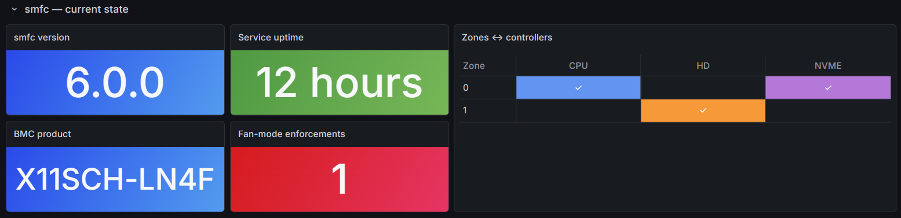
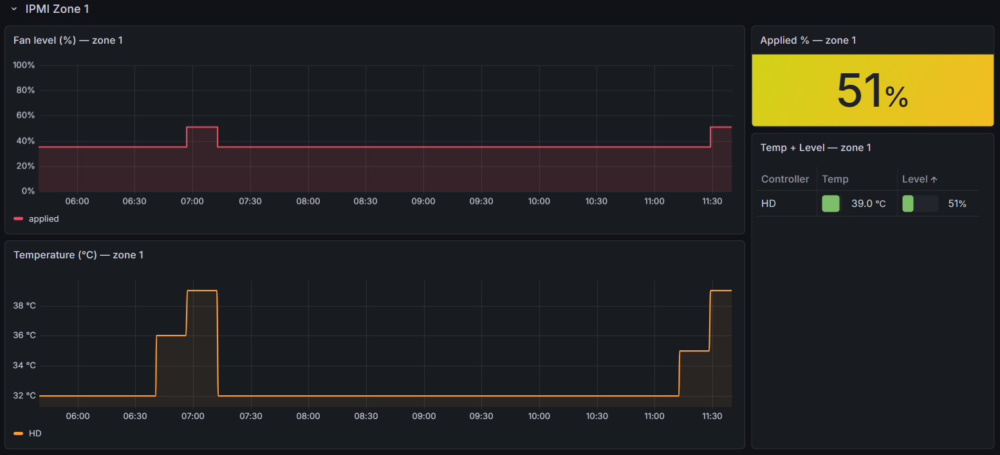

# `smfc` Grafana integration

This document explains how the `smfc` HTTP exporter works, what Prometheus metrics it exposes, how to build a Docker stack with `smfc`, Prometheus, and Grafana, and how to use the bundled sample dashboard.

---

## How the HTTP exporter works

`smfc` embeds a lightweight HTTP server (stdlib `http.server`, one daemon thread). It starts when `[Exporter] enabled = true` is set in `smfc.conf` and stops cleanly when the service exits. Fan control is never gated on the HTTP server: if the bind fails, `smfc` logs a warning and continues without it.

The server exposes two paths relevant to Grafana:

| Path | Content-Type | Description |
|---|---|---|
| `GET /healthz` | `text/plain` | Returns `ok` — suitable for liveness probes |
| `GET /metrics` | `text/plain; version=0.0.4` | Prometheus exposition format |

`/metrics` is generated from the same in-memory state that the main control loop updates on each polling cycle. The handler reads only cached values — it never calls `ipmitool` or `smartctl` — so responses are fast and non-blocking.

---

## Configuration

Add an `[Exporter]` section to `smfc.conf`:

```ini
[Exporter]
# Enable the HTTP exporter (bool, default=false)
enabled=true
# IP to bind on; use 127.0.0.1 for local-only, 0.0.0.0 for remote Prometheus
bind_address=127.0.0.1
# TCP port (int, 1..65535, default=9099)
port=9099
```

For Prometheus running on a different host, set `bind_address=0.0.0.0` (or the server's LAN IP) so the port is reachable from outside.

---

## Exported metrics

All metrics are gauges unless noted. Labels are enclosed in `{…}`.

### Service identity

| Metric | Labels | Value | Description |
|---|---|---|---|
| `smfc_up` | `version` | 1 | Liveness; carries the running `smfc` version |
| `smfc_start_time_seconds` | — | Unix time | Wall-clock start time of the `smfc` process |
| `smfc_bmc_info` | `product_name`, `firmware_version`, `manufacturer_name` | 1 | BMC identity from `ipmitool bmc info` |
| `smfc_fan_mode_enforced_total` | — | counter | Times `smfc` re-asserted FULL after the BMC fan mode drifted |

### Static configuration (changes only on restart)

| Metric | Labels | Description |
|---|---|---|
| `smfc_controller_zone` | `section`, `type`, `zone` | Enabled controller-to-IPMI-zone mapping; value always 1 |
| `smfc_controller_temperature_min_celsius` | `section`, `type`, `zone` | Steering-window floor (not emitted for `const` controllers) |
| `smfc_controller_temperature_max_celsius` | `section`, `type`, `zone` | Steering-window ceiling (not emitted for `const` controllers) |
| `smfc_controller_level_min_percent` | `section`, `type`, `zone` | Fan-level-window floor |
| `smfc_controller_level_max_percent` | `section`, `type`, `zone` | Fan-level-window ceiling |

The `type` label is one of: `cpu`, `hd`, `nvme`, `gpu`, `const`.
The `section` label matches the INI section name (`CPU`, `HD`, `NVME`, `GPU`, `CONST`).
Each enabled controller emits one row per IPMI zone it targets (controllers can target multiple zones).

### Dynamic runtime (updates every polling cycle)

| Metric | Labels | Description |
|---|---|---|
| `smfc_controller_temperature_celsius` | `section`, `type`, `zone` | Aggregated temperature driving the controller; one row per targeted zone; skipped for `const` |
| `smfc_device_temperature_celsius` | `section`, `type`, `device` | Per-device temperature (individual CPU core, disk path, NVMe device, GPU index) |
| `smfc_controller_level_percent` | `section`, `type`, `zone` | Fan level (0–100) requested by the controller per targeted zone |
| `smfc_zone_level_percent` | `zone` | Fan level actually applied to the IPMI zone after multi-controller arbitration (winner = max) |
| `smfc_disk_standby` | `section`, `device` | Disk standby state: 1 = standby, 0 = active (only emitted when standby guard is enabled) |

The `device` label for disk controllers is the full `/dev/disk/by-id/…` path from the `smfc` configuration.

### Sample `/metrics` output

The following shows a complete response from a system with one CPU, eight SATA hard drives, and six NVMe SSDs:

```
$ curl -s http://127.0.0.1:9099/metrics
# HELP smfc_up smfc service is up (1); carries the running version.
# TYPE smfc_up gauge
smfc_up{version="6.0.0"} 1

# HELP smfc_start_time_seconds Unix start time of the smfc service.
# TYPE smfc_start_time_seconds gauge
smfc_start_time_seconds 1782230122.9168901

# HELP smfc_bmc_info BMC identity reported by ipmitool bmc info.
# TYPE smfc_bmc_info gauge
smfc_bmc_info{product_name="X11SCH-LN4F",firmware_version="1.74",manufacturer_name="Super Micro Computer Inc."} 1

# HELP smfc_fan_mode_enforced_total Times smfc re-asserted FULL after the BMC fan mode drifted.
# TYPE smfc_fan_mode_enforced_total counter
smfc_fan_mode_enforced_total 0

# HELP smfc_controller_zone Enabled fan-controller-to-IPMI-zone mapping (value always 1).
# TYPE smfc_controller_zone gauge
smfc_controller_zone{section="CPU",type="cpu",zone="0"} 1
smfc_controller_zone{section="HD",type="hd",zone="1"} 1
smfc_controller_zone{section="NVME",type="nvme",zone="0"} 1

# HELP smfc_controller_temperature_min_celsius Controller steering-window floor (static config).
# TYPE smfc_controller_temperature_min_celsius gauge
# HELP smfc_controller_temperature_max_celsius Controller steering-window ceiling (static config).
# TYPE smfc_controller_temperature_max_celsius gauge
smfc_controller_temperature_min_celsius{section="CPU",type="cpu",zone="0"} 35.0
smfc_controller_temperature_max_celsius{section="CPU",type="cpu",zone="0"} 75.0
smfc_controller_temperature_min_celsius{section="HD",type="hd",zone="1"} 35.0
smfc_controller_temperature_max_celsius{section="HD",type="hd",zone="1"} 48.0
smfc_controller_temperature_min_celsius{section="NVME",type="nvme",zone="0"} 38.0
smfc_controller_temperature_max_celsius{section="NVME",type="nvme",zone="0"} 65.0

# HELP smfc_controller_level_min_percent Controller fan-level-window floor (static config).
# TYPE smfc_controller_level_min_percent gauge
# HELP smfc_controller_level_max_percent Controller fan-level-window ceiling (static config).
# TYPE smfc_controller_level_max_percent gauge
smfc_controller_level_min_percent{section="CPU",type="cpu",zone="0"} 35
smfc_controller_level_max_percent{section="CPU",type="cpu",zone="0"} 100
smfc_controller_level_min_percent{section="HD",type="hd",zone="1"} 35
smfc_controller_level_max_percent{section="HD",type="hd",zone="1"} 100
smfc_controller_level_min_percent{section="NVME",type="nvme",zone="0"} 35
smfc_controller_level_max_percent{section="NVME",type="nvme",zone="0"} 100

# HELP smfc_controller_temperature_celsius Per-controller temperature, per targeted zone; skipped for CONST.
# TYPE smfc_controller_temperature_celsius gauge
smfc_controller_temperature_celsius{section="CPU",type="cpu",zone="0"} 35.0
smfc_controller_temperature_celsius{section="HD",type="hd",zone="1"} 33.0
smfc_controller_temperature_celsius{section="NVME",type="nvme",zone="0"} 43.0

# HELP smfc_device_temperature_celsius Per-device temperature reading.
# TYPE smfc_device_temperature_celsius gauge
smfc_device_temperature_celsius{section="CPU",type="cpu",device="cpu0"} 35.0
smfc_device_temperature_celsius{section="HD",type="hd",device="/dev/disk/by-id/ata-ST16000VN001-2KW103_ZR2A1B3C"} 32.0
smfc_device_temperature_celsius{section="HD",type="hd",device="/dev/disk/by-id/ata-ST16000VN001-2KW103_ZR2D4E5F"} 33.0
smfc_device_temperature_celsius{section="HD",type="hd",device="/dev/disk/by-id/ata-ST16000VN001-2KW103_ZR2G6H7I"} 31.0
smfc_device_temperature_celsius{section="HD",type="hd",device="/dev/disk/by-id/ata-ST16000VN001-2KW103_ZR2J8K9L"} 34.0
smfc_device_temperature_celsius{section="HD",type="hd",device="/dev/disk/by-id/ata-ST16000VN001-2KW103_ZR2M0N1O"} 30.0
smfc_device_temperature_celsius{section="HD",type="hd",device="/dev/disk/by-id/ata-ST16000VN001-2KW103_ZR2P2Q3R"} 33.0
smfc_device_temperature_celsius{section="HD",type="hd",device="/dev/disk/by-id/ata-ST16000VN001-2KW103_ZR2S4T5U"} 31.0
smfc_device_temperature_celsius{section="HD",type="hd",device="/dev/disk/by-id/ata-ST16000VN001-2KW103_ZR2V6W7X"} 32.0
smfc_device_temperature_celsius{section="NVME",type="nvme",device="/dev/disk/by-id/nvme-Samsung_SSD_980_PRO_2TB_S5GVNF0T123456"} 43.0
smfc_device_temperature_celsius{section="NVME",type="nvme",device="/dev/disk/by-id/nvme-Samsung_SSD_980_PRO_2TB_S5GVNF0T789ABC"} 39.0
smfc_device_temperature_celsius{section="NVME",type="nvme",device="/dev/disk/by-id/nvme-KINGSTON_SKC3000D_2048G_50026B768601A2B3"} 41.0
smfc_device_temperature_celsius{section="NVME",type="nvme",device="/dev/disk/by-id/nvme-KINGSTON_SKC3000D_2048G_50026B768604C5D6"} 38.0
smfc_device_temperature_celsius{section="NVME",type="nvme",device="/dev/disk/by-id/nvme-KINGSTON_SKC3000D_2048G_50026B768607E8F9"} 42.0
smfc_device_temperature_celsius{section="NVME",type="nvme",device="/dev/disk/by-id/nvme-KINGSTON_SKC3000D_2048G_50026B76860A1B2C"} 40.0

# HELP smfc_controller_level_percent Fan level requested by the controller, per targeted zone.
# TYPE smfc_controller_level_percent gauge
smfc_controller_level_percent{section="CPU",type="cpu",zone="0"} 35
smfc_controller_level_percent{section="HD",type="hd",zone="1"} 35
smfc_controller_level_percent{section="NVME",type="nvme",zone="0"} 35

# HELP smfc_zone_level_percent Fan level applied to the IPMI zone after arbitration.
# TYPE smfc_zone_level_percent gauge
smfc_zone_level_percent{zone="0"} 35
smfc_zone_level_percent{zone="1"} 35

# HELP smfc_disk_standby Disk standby state (1=standby, 0=active).
# TYPE smfc_disk_standby gauge
smfc_disk_standby{section="HD",device="/dev/disk/by-id/ata-ST16000VN001-2KW103_ZR2A1B3C"} 1
smfc_disk_standby{section="HD",device="/dev/disk/by-id/ata-ST16000VN001-2KW103_ZR2D4E5F"} 1
smfc_disk_standby{section="HD",device="/dev/disk/by-id/ata-ST16000VN001-2KW103_ZR2G6H7I"} 1
smfc_disk_standby{section="HD",device="/dev/disk/by-id/ata-ST16000VN001-2KW103_ZR2J8K9L"} 1
smfc_disk_standby{section="HD",device="/dev/disk/by-id/ata-ST16000VN001-2KW103_ZR2M0N1O"} 1
smfc_disk_standby{section="HD",device="/dev/disk/by-id/ata-ST16000VN001-2KW103_ZR2P2Q3R"} 1
smfc_disk_standby{section="HD",device="/dev/disk/by-id/ata-ST16000VN001-2KW103_ZR2S4T5U"} 1
smfc_disk_standby{section="HD",device="/dev/disk/by-id/ata-ST16000VN001-2KW103_ZR2V6W7X"} 1
```

---

## Docker stack: `smfc` + Prometheus + Grafana

### Architecture

`smfc` must run directly on the Supermicro host — it needs raw access to `/dev/ipmi0` (IPMI), disk device nodes (smartctl), and CPU/GPU sensor interfaces. Prometheus and Grafana can run anywhere that has network access to the `smfc` host.

```
┌─────────────────────────────── Supermicro host ────────────────────────────────┐
│                                                                                │
│   smfc (systemd service)                                                       │
│     └── HTTP exporter → 0.0.0.0:9099                                           │
│          ├── GET /metrics  (Prometheus text format)                            │
│          └── GET /healthz  (liveness probe)                                    │
│                                                                                │
└────────────────────────────────────────────────────────────────────────────────┘
           │ scrape :9099/metrics every 15s
           ▼
┌────────────────────────── Docker host (any machine) ───────────────────────────┐
│                                                                                │
│   prometheus:9090  ─── Grafana datasource ──►  grafana:3000                    │
│                                                                                │
└────────────────────────────────────────────────────────────────────────────────┘
```

Both Docker containers can run on the same Supermicro host or on a separate monitoring machine on the same LAN.

---

### Step 1 — enable the `smfc` exporter

In `/etc/smfc/smfc.conf` on the Supermicro host:

```ini
[Exporter]
enabled=true
# Bind to all interfaces so Prometheus can reach it from the Docker host
bind_address=0.0.0.0
port=9099
```

Restart the service:

```bash
systemctl restart smfc
```

Verify:

```bash
curl -s http://localhost:9099/healthz
curl -s http://localhost:9099/metrics | head -20
```

---

### Step 2 — Prometheus configuration

Create `prometheus.yml`:

```yaml
global:
  scrape_interval: 15s
  evaluation_interval: 15s

scrape_configs:
  - job_name: smfc
    static_configs:
      # Replace with the actual IP of the Supermicro host
      - targets: ["192.168.1.10:9099"]
    metrics_path: /metrics
```

---

### Step 3 — Docker Compose stack

Create `docker-compose.yml` alongside `prometheus.yml`:

```yaml
services:
  prometheus:
    image: prom/prometheus:latest
    container_name: prometheus
    restart: unless-stopped
    ports:
      - "9090:9090"
    volumes:
      - ./prometheus.yml:/etc/prometheus/prometheus.yml:ro
      - prometheus_data:/prometheus
    command:
      - "--config.file=/etc/prometheus/prometheus.yml"
      - "--storage.tsdb.retention.time=30d"

  grafana:
    image: grafana/grafana-oss:latest
    container_name: grafana
    restart: unless-stopped
    ports:
      - "3000:3000"
    environment:
      - GF_SECURITY_ADMIN_PASSWORD=admin
    volumes:
      - grafana_data:/var/lib/grafana

volumes:
  prometheus_data:
  grafana_data:
```

Start the stack:

```bash
docker compose up -d
docker compose logs -f
```

---

### Step 4 — wire Grafana to Prometheus

1. Open Grafana at `http://<docker-host>:3000` (default credentials: `admin` / `admin`).
2. Go to **Connections → Data sources → Add data source → Prometheus**.
3. Set the URL to `http://prometheus:9090` (Docker internal DNS).
4. Click **Save & test**.

---

### Step 5 — example PromQL queries

```promql
# Is smfc running?
smfc_up

# Per-zone applied fan level
smfc_zone_level_percent

# Per-controller temperature
smfc_controller_temperature_celsius

# Per-device temperature (all devices)
smfc_device_temperature_celsius

# Fan level requested by each controller
smfc_controller_level_percent

# Disk standby states
smfc_disk_standby

# How many times did smfc have to re-assert FULL mode?
smfc_fan_mode_enforced_total
```

---

### Notes

- **Retention**: the default `--storage.tsdb.retention.time=30d` keeps 30 days of data. Add `--storage.tsdb.retention.size=10GB` as needed.
- **Security**: the exporter has no authentication. On a LAN, binding to the server's specific IP (instead of `0.0.0.0`) and restricting the port at the firewall is sufficient for most home-server setups.
- **Polling cadence**: `smfc` polling intervals (typically 2–10 s per controller) drive how often values change. A Prometheus scrape interval of 15 s captures all transitions without excessive overhead.

---

## Sample dashboard (`smfc.json`)

The file [`grafana/smfc.json`](https://github.com/petersulyok/smfc/blob/main/grafana/smfc.json) is a ready-to-import Grafana dashboard (UID: `smfc-prometheus`, schema version 38, title: *SMFC — Super Micro Fan Control*). It is pre-wired to the `smfc_*` metric namespace and assumes the Prometheus datasource added in Step 4 above.

### Importing

1. In Grafana, go to **Dashboards → Import**.
2. Click **Upload dashboard JSON file** and select `smfc.json`.
3. Select the Prometheus datasource created earlier.
4. Click **Import**.

The dashboard opens immediately and begins populating as soon as Prometheus has scraped at least one cycle from `smfc`.

### Dashboard layout

The dashboard is organised into three collapsible row sections.

#### `smfc` — current state

The top row shows service-level status at a glance:



- **smfc version** — the running version string from `smfc_up{version}`.
- **Service uptime** — derived from `smfc_start_time_seconds`.
- **BMC product** — board name from `smfc_bmc_info{product_name}`.
- **Fan-mode enforcements** — lifetime count from `smfc_fan_mode_enforced_total`; turns red when non-zero.
- **Zones ↔ controllers** — table built from `smfc_controller_zone`; one column per controller type, one row per IPMI zone, coloured cell marks an active assignment.

#### IPMI Zone 0

One row section per IPMI zone. The example below shows Zone 0 with CPU and NVME controllers assigned:


- **Fan level (%) — zone 0** — time-series of `smfc_zone_level_percent{zone="0"}` (the arbitrated applied level).
- **Temperature (°C) — zone 0** — time-series of `smfc_controller_temperature_celsius` for all controllers targeting zone 0.
- **Applied % — zone 0** — large stat showing the current applied fan level; colour-coded by threshold.
- **Temp + Level — zone 0** — table of `smfc_controller_temperature_celsius` and `smfc_controller_level_percent` per controller, with the level rendered as a bar gauge; the winning controller (highest level) is highlighted.

#### IPMI Zone 1

Same layout as Zone 0, here with only the HD controller assigned:



The HD temperature trace shows the stepped profile typical of spinning disks: temperature rises slowly under load and drops sharply once the array spins down. The fan level follows with the same steps.

### Adapting the dashboard

The sample dashboard is wired for two IPMI zones (0 and 1). To extend it for additional zones, duplicate an existing zone row, update the `zone` label filter in each panel's query, and adjust the row title. No other changes are needed — the metric schema is identical across zones.
